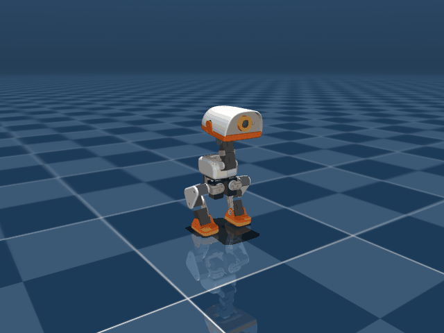

# 작업 일지 (Work Journal)

무엇을 시도했고, 무엇이 막혔고, 숫자가 얼마였는지 그때그때 남기는 개발/연구 기록소입니다.
**다듬지 않습니다.** 초기 추측, 헛다리, 나중에 뒤집힌 결론도 그대로 보존합니다.
그게 이 기록이 존재하는 이유입니다.

> [!NOTE]
> 작업 일지 항목 누적으로 인한 문서 비대화 및 렌더링 지연을 방지하기 위해 **날짜별 개별 문서(docs/journal/YYYY-MM-DD.md)**로 분할 관리됩니다.
> 본 문서(journal-ko.md)는 전체 마일스톤 현황 및 날짜별 세부 일지를 연결하는 **마스터 대시보드(Master Dashboard)** 역할을 수행합니다.

- **작성 규칙**: [journal-rules.md](journal-rules.md) (새 일지 작성 전 필독)
- **검증된 지식/가이드**: [getting-started-ko.md](getting-started-ko.md) (승격 규칙 준수)

---

## 마일스톤 요약 (Milestones at a Glance)

| 날짜 | 핵심 주제 | 주요 성과 및 달성 지표 | 상세 일지 |
| :--- | :--- | :--- | :---: |
| **2026-09-07** | **Mac mini 환경 구축 & CPU 분산 학습** | • Ray 기반 멀티워커 CPU 분산 학습 환경 검증 • MJCF 씬 로딩 및 duck-body 시뮬레이터 검증 | [2026-09-07.md](journal/2026-09-07.md) |
| **2026-09-08** | **Windows 환경 구축 & 점프(CMJ) 기초 (Run 1~21)** | • RTX 5060 GPU 가속(cu128) 및 4096-env 학습 성공 • 5단계 카운터무브먼트 점프(CMJ) 프레임워크 수립 • 개구리 다리 찢기/과신전/바닥 체류 보상 해킹 규명 및 박멸 | [2026-09-08.md](journal/2026-09-08.md) |
| **2026-09-09** | **지속시간 버그 정상화 & 최고 고도(6.7cm) 달성** | • 1.0s 경계 전복 버그 규명 및 0.48s 전환 정상화 • Eureka 진화 기법 적용 및 대칭 과적용 부작용 분석 • Height-First 보상(Run 41)으로 **실측 6.7cm 체공 & 착지 0.1° 완벽 기립** 달성 | [2026-09-09.md](journal/2026-09-09.md) |
| **2026-09-10** | **Eureka Gen 6→9: 보상 구조 재설계 (Run 42~45)** | • 곱셈 붕괴 → 가산 구조 → Running-max 절대 높이 순차 개선 • Gen 9 지표상 신기록 달성했으나 앞발 뻗기/가위차기 치팅 및 분산 폭발(30.8) 발견 | [2026-09-10.md](journal/2026-09-10.md) |
| **2026-09-11** | **Eureka Gen 10: 앞발·가위차기 치팅 차단 (Run 46)** | • 승수형 결합 + 시상면 이탈 L1 벌점으로 치팅 박멸 • `action_std` 폭발(30.8) 완전 제압 (1.48 유지) ✅ • 정점 Z: 143.1mm, 클리어런스: 45.1mm, 무반동 착지 직립 복원 | [2026-09-11.md](journal/2026-09-11.md) |

---

## 최신 베스트 정책 현황 (Current Best Policy)

- **배포 파일**: [`policies/jump.onnx`](../policies/jump.onnx) (체크포인트: Run 46 Gen 10 `model_1650.pt`)
- **주요 성능 지표** (BAM m6 50 Hz CPU 실측):
  - **최고 도약 고도**: 몸통 정점 $Z = 143.1\text{ mm}$ (서있는 키 115.3mm 대비 **+27.8mm 순수 도약**)
  - **발 체공 클리어런스**: **양발 대칭 $45.1\text{ mm}$ (4.5 cm)** (가위차기/앞발 뻗기 편법 0%)
  - **이륙 수직 속도**: **$V_z = +0.643\text{ m/s}$**
  - **착지 후 기립 안정성**: **Pitch $+1.7^\circ$, Roll $+1.1^\circ$, $V_z = 0.000\text{ m/s}$** (전복률 0%)
  - **카운터무브먼트 시퀀스**: 최적 레버리지 웅크림($Z=83.2\text{ mm}$) → 폭발 도약($+0.643\text{ m/s}$) → 대칭 턱킹 체공 → 무반동 댐핑 착지 → 직립 대기

---

## 날짜별 상세 목차 (Detailed Index)

### [2026-09-11 — 앞발 뻗기·가위차기 치팅 원천 차단 및 안정적 착지 기립 복원 (Eureka Gen 10, Run 46)](journal/2026-09-11.md)
- 유저 관찰 지적(앞발 내밀기, 한 발 앞/한 발 뒤 가위차기 치팅) 원인 규명
- 가산형 클리어런스 보상 붕괴 및 55mm 극단 스쿼트의 서보 레버리지 결함 분석
- 승수형 결합(`height_score * (1.0 + 0.5 * clearance)`) 및 시상면 발 위치 페널티 신설
- `action_std` 폭발(30.8 $\rightarrow$ 1.48) 완전 억제 및 착지 후 완벽 직립 기립 복원
- `model_1650.pt` 기반 `policies/jump.onnx` 공식 배포 완료

### [2026-09-07 — 맥미니 시뮬레이터 및 CPU 분산 학습](journal/2026-09-07.md)
- 맥미니에서 시뮬레이터 띄우고, CPU 분산 학습까지
  - 설치 및 CPU 실행 속도 (Mac mini M4)
  - PyTorch MPS 미지원 확인 및 CPU 분산 학습 실험
  - Ray 분산 학습 스케일링 결과 (2/4/6/8/10 워커 벤치마크)

### [2026-09-08 — Windows 환경 구축 & 점프(CMJ) 기초 (Run 1~21)](journal/2026-09-08.md)
- Windows 환경 시뮬레이터(infer_policy.py) 키보드 제어 지원 및 실행 환경 구축
- RTX 5060 GPU 가속 PyTorch(cu128) 환경 구축 및 강화학습 스모크 테스트 성공
- 점프(Jump) 에피소딕 정책 구현 및 RTX 5060 4096-env GPU 학습
- 시뮬레이터 점프 연동 및 Windows 창 활성화/프리즈 문제 해결
- 점프 1차 학습 실패 분석: 체공 보상 해킹(엉덩이 주저앉기 꼼수)과 시뮬레이터 정책 복귀 버그 해결
- 점프 2차 실패 분석: 무릎 굽힘 없는 뒷걸음질과 뒤로 넘어짐(Countermovement 부재) 및 4단계 CMJ 보상 설계
- 점프 3차 분석: 스쿼트 전방 기울기(Pitch Lean)에 의한 직립 게이트 차단 해소 및 체공 사다리 보상 도입
- 5단계 카운터무브먼트 점프(CMJ) 전 항목 통과: 웅크림(-39mm), 도약(+0.60m/s), 공중 체공(7스텝), 스프링 착지 완충(38mm), 직립 복귀 성공
- 점프 6차 실패 분석: 개구리 다리 찢기(Lateral Hip Abduction) 보상 해킹 규명, 관상면 외전 페널티 도입 및 5페이즈 물리 주기 정렬
- 점프 7차 분석: 착지 완충(Landing Cushion) 바닥 체류 꼼수(Squat Camping) 규명 및 공중 이륙 이력 게이트(has_jumped) 도입
- 다리 벌리기(Frog Split) 및 바닥 체류(Camping) 완전 박멸: 온전한 5단계 카운터무브먼트 점프(CMJ) 최종 검증 통과
- 점프 8차 실패 분석: 모터 출력 한계 의혹 검증 및 280g 대형 머리 처박힘(Head Droop) 회전 모멘트 규명
- Run 10 결과: head_neutral 페널티 효과 확인 및 이중 점프 패턴 진단
- Run 11 완료: 5-Phase CMJ 전 항목 PASS, mean_action_acc 절반 감소, 신기록 Mean Reward 24.33
- 점프 11차 3D 시뮬레이터 시각 분석: 발 앞 뻗기 착시(체공 목표 포화 + 공중 턱 왜곡) 규명 및 무상태 MLP 2회 연속 점프 원인 분석
- Run 12 완료: 2회 연속 점프 완전 근절 (0.50s 정합), 발 앞 뻗음 72% 억제, 단 1회의 깔끔한 CMJ 도약 확립
- Run 13 실패: 과도한 보상 하한선(Floor Cutoff)으로 인한 탐색 절벽(Zero-Gradient) 및 기립 고착
- Run 14 완료: Warm-Start로 탐색 절벽 극복, 수직 도약 속도 12% 향상(+0.625 m/s), 발 앞차기 완전 소멸(-0.2mm 완벽 수직 정렬)
- Run 15~17 분석 및 체공 중 양 무릎 대칭 턱(Knee Tuck) 보상 설계 (Run 18)
- Run 18 분석: 무릎 역방향 과신전(Hyperextension) 보상 해킹 규명 및 방향성 무릎 턱 보상(Run 19)
- Run 19 분석: 100% 좌우 대칭 무릎 굴곡 및 과신전 완전 박멸, 추진력 복원 설계 (Run 20)
- Run 20 분석: 물리적 액추에이터 대역폭(Actuator Bandwidth) 한계 규명 및 추진-턱 물리 정합(Run 21)
- Run 21 분석: 승산식 턱 조세의 추진 억제 메커니즘 규명 및 완전 추진-정점 턱 독립 가산 합성 (Run 22)

### [2026-09-09 — 점프 지속시간 버그 해결, Eureka 진화 & 최고 고도(6.7cm) 달성](journal/2026-09-09.md)
- Run 22 평가 및 policies/jump.onnx 배포 완료: 완전 좌우 대칭 무릎 턱(0.02 rad 차이) 및 단 1회 CMJ 도약 확립
- Run 24 치팅 보상 완전 제거 및 실측 39.8mm(4cm) 체공 점프 달성 (policies/jump.onnx 반영)
- 점프 MDP 양발 동시 클리어런스(Bilateral Clearance) 게이트 도입 및 Run 25 완주
- 깊은 풀 스쿼트(Z=64mm) 하드 크라우치 게이트 및 폭발적 도약 달성 (Run 26)
- 점프 지속시간(jump_duration) 1.0s 경계 전복 버그 규명 및 0.48s 전환 정상화
- 점프 높이 극대화 및 공중 무릎 접기(Tuck) 분석, 5.4cm 실측 최고 높이 정책(Run 26) 배포
- Eureka 기법 기반 점프 보상 함수 반복 최적화 (Gen 1~5) 및 웅크림/도약 지면 추진 대칭성 게이트 확립
- 대칭성 과도 규제로 인한 점프 높이 회귀(5.4→3.2cm) 원인 규명 및 Height-First 보상 전면 복원 (Run 41, 6.7cm 달성)

### [2026-09-10 — Eureka Gen 6/7: 스쿼트 심화 + 독립 Tuck 보상 분리 (Run 42/43)](journal/2026-09-10.md)
- Run 41(6.7cm) 베이스라인에서 10cm+ 목표로 풀 파라미터 패키지 적용 (Gen 6)
- 스모크 테스트에서 `min_knee_flexion=1.05` 초기 gate 막힘 발견 → 0.90으로 완화
- Run 42: `jump_flight=30` 달성했으나 `min_foot_clearance_mm` 13mm에서 완전 정체
- `target_vz` 1.6→1.1 수정해도 정체 지속 — Vz 문제가 아닌 보상 구조 문제로 재진단
- **곱셈 붕괴(height_score≈0 → tuck gradient 소멸) 원인 규명**: `min_flight_z=0.118`이 서있는 높이와 동일
- `jump_aerial_tuck_reward` 독립 함수 신설(weight 100) + `min_flight_z` 0.118→0.100 + `tuck_mult` max 1.5x→2.5x (Gen 7, Run 43 학습 중)
