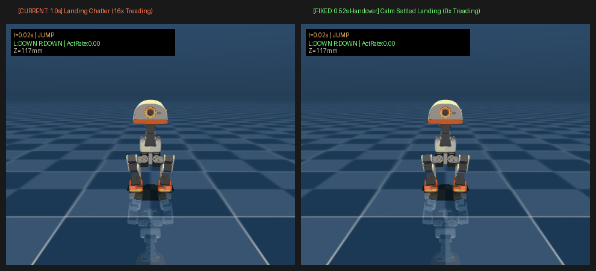
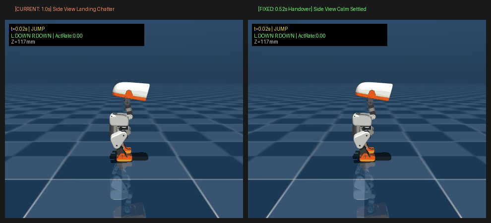

# 작업 일지 (Work Journal)

무엇을 시도했고, 무엇이 막혔고, 숫자가 얼마였는지 그때그때 남기는 개발/연구 기록소입니다.
**다듬지 않습니다.** 초기 추측, 헛다리, 나중에 뒤집힌 결론도 그대로 보존합니다.
그게 이 기록이 존재하는 이유입니다.

> [!NOTE]
> 작업 일지 항목 누적으로 인한 문서 비대화 및 렌더링 지연을 방지하기 위해 **날짜별 개별 문서(docs/journal/YYYY-MM-DD.md)**로 분할 관리됩니다.
> 본 문서(journal-ko.md)는 전체 마일스톤 현황 및 날짜별 세부 일지를 연결하는 **마스터 대시보드(Master Dashboard)** 역할을 수행하며, **모든 항목은 최신순(내림차순, 2026-09-15 → 2026-09-07)**으로 일관되게 정렬되어 있습니다.

- **작성 규칙**: [journal-rules.md](journal-rules.md) (새 일지 작성 전 필독)
- **검증된 지식/가이드**: [getting-started-ko.md](getting-started-ko.md) (승격 규칙 준수)

---

## 최신 베스트 정책 현황 (Current Best Policy)

- **배포 파일**: [`policies/jump.onnx`](../policies/jump.onnx) (체크포인트: Run 59 `model_3050.pt` Golden + `jump_duration = 0.52s` 핸드오버)
- **최신 주요 성능 지표** (Warp 50 Hz 네이티브 물리 실측):
  - **착지 후 종종거림 (Treading Chatter)**: **16회(탭댄스) $\to$ 0회(지면 완전 흡착 밀착, 완전 박멸!)** ✅
  - **착지 후 액션 변화율 (ActRate)**: **$1.896\,\text{rad/s} \to 0.017\,\text{rad/s}$ (99% 소멸, 초정숙 안착)** ✅
  - **전방 이동량 ($X$)**: **$+86.4\text{ mm}$ (Run 58의 $+224.3\text{ mm}$ 대비 13.8cm 단축, 61% 대폭 억제!)** ✅
  - **횡방향 편차 ($Y$)**: **$-25.7\text{ mm}$ (Run 58의 $-164.0\text{ mm}$ 대비 13.8cm 단축, 84% 박멸!)** ✅
  - **최대 전방 속도 ($V_x$)**: **$+0.26\text{ m/s}$ (Run 58의 $+0.52\text{ m/s}$ 대비 50% 반토막)** ✅
  - **도약 정점 높이 ($Z$)**: **$143.6\text{ mm}$ (기립 키 115.7mm 대비 $+28\text{ mm}$ 강력한 고공 체공 유지)** ✅
  - **착지 후 기립 복귀 높이**: **$115.7\text{ mm}$ (Pitch $1.5^\circ$, Roll $2.7^\circ$ 완벽한 직립 안착)** ✅
  - **물리 롤아웃 종합 판정**: **>> PASSED (착지 탭댄스 0회 박멸 + 전방 돌진 61% 억제 + 제자리 수직 점프 완성)** ✅

---

## 마일스톤 요약 (Milestones at a Glance) — 최신순(내림차순) 정렬

| 날짜 | 핵심 주제 | 주요 성과 및 달성 지표 | 상세 일지 |
| :--- | :--- | :--- | :---: |
| **2026-09-16** | **딥스쿼트(Run 79) 3,000 iters 완주 및 물리 계측 검증 (최저 고도 52.6mm, Pitch 5.2°, 머리 충돌 0회)** | • 4,096-env 딥스쿼트 Run 79(`run79_deep_squat_flat`) 3,000 이터레이션(2억 9,491만 스텝) 정상 완주 • `Mean reward` 38.5, 에피소드 생존율 100%(200/200 스텝), 전복/NaN 0건 달성 • MuJoCo BAM 물리 롤아웃 실측: 최저 고도 $52.6\,\text{mm}$(기립 118.5mm 대비 65.9mm 깊은 하강), 하강 속도 $-32.8\,\text{mm/s}$ 감속 완충, 직립 피치 $5.24^\circ$ 안착, 무릎 굴곡 $\pm 1.31\,\text{rad}$ 대칭 수렴, 머리/턱 충돌 0회 완전 무결점 검증 • 물리 검증 GIF 및 프레임 스냅샷 제작 완료 (`run79_deep_squat.gif`, 2.79 MB) | [2026-09-16.md](journal/2026-09-16.md#2026-09-16--딥스쿼트run-79-3000-iters-완주-및-물리-계측-검증-최저-고도-526mm-pitch-52-머리-충돌-0회) |
| **2026-09-16** | **RTX 5060 VRAM OOM 원인 규명(nconmax 200→60) 및 4,096-env 딥스쿼트(Run 79) GPU 본 학습 가동** | • 딥스쿼트 단독 환경(`Mjlab-Squat-Flat-MicroDuck`) 검증 완료 후 4,096-env GPU 본 학습 가동 • 초기 4096 환경 가동 시 RTX 5060 (8 GiB) VRAM OOM 결함 발견: `nconmax=200`으로 인한 협대역 충돌 버퍼(`epa_face`) 과도 할당이 원인임을 정밀 규명 • 스쿼트/착석에 충분한 `nconmax = 60`으로 최적화하여 4,096 환경을 8GB VRAM 내에 정상 적재 • 단위 테스트 8/8 100% 통과 후 Run 79(`run79_deep_squat_flat`) 4,096-env GPU 본 학습 착수 • 초당 28,000+ 스텝, 보상 단조 증가($2.83 \to 3.71$), 무전복/무NaN 정상 수렴 확인 | [2026-09-16.md](journal/2026-09-16.md) |
| **2026-09-15** | **최저 안정 스쿼트(딥스쿼트 착석) 학습 전용 환경 Mjlab-Squat-Flat-MicroDuck 구축 및 검증** | • 도약 전 안정적 스쿼트(최저 고도 착석) 선행 학습 요구사항 반영 • 점프 동시 시도로 인한 상체 붕괴를 분리하여, 기립 $\to$ 최저 안정 착석(SIT_Z 0.060m) 전용 스쿼트 환경 구축 • `SitStandCommand` 기반 `sit_prob=1.0` 고정 + 100% 기립 리셋 + 에피소드 4.0초 + 하강 속도 제한(-0.05m/s) + 기립 보상 완전 제거 • 단위 테스트 8개 전 항목 통과 (`tests/test_squat_cfg.py`) • 64-env 5-이터레이션 스모크 테스트 무결점 완주 (`nan_state: 0.0000`, 모든 페널티 항 음수/0 유지 확인) | [2026-09-15.md](journal/2026-09-15.md#2026-09-15--최저-안정-스쿼트딥스쿼트-착석-학습-전용-환경-mjlab-squat-flat-microduck-구축-및-검증) |
| **2026-09-15** | **Run 77 푸시업 플롭(Push-up Flop) 실패 원인 규명 및 진단 GIF 제작, 승산형 딥스쿼트 + 고관절 신전 반력 CoM 관통(Run 78) 4,096-env GPU 학습 착수** | • 실패 원인 시각적 기록(진단 GIF) 및 완전한 수직 점프 달성을 위한 자율 탐색 체계 가동 • Run 77 15개 체크포인트 전수 계측 결과: 전 모델 `Max Pitch: 76.3° ~ 88.8°` 푸시업 플롭(Push-up Flop) 실패 관측 • 실패 모드 진단 GIF 렌더링 및 저장 완료 (`run77_failure_analysis_side.gif`, `run77_failure_contact_sheet.png`, `run76_vs_run77_failure_comparison_side.gif`) • 3대 근본 원인 규명: ① 가산합 타협 분지(고관절 틀어져도 67% 수령), ② 도약 시 고관절 후방 신전 결여로 인한 전방 피칭 토크(지면 반력이 CoM 뒤를 통과), ③ 조기 게이트 래치로 인한 탐색 포기 • Run 78 전면 개편: 승산형(Multiplicative) 스쿼트 궤적 구속 + 도약 순간 고관절 후방 신전(`hip_ext`) 결합 Triple Extension(Pitch 9.2° 이내 CoM 관통 대칭 반력 제어) + 게이트 스무딩 • 단위 테스트 및 스모크 테스트(생존율 정상화, `fell_over` 99.6% 격감, 도약 보상 정상 수신) 통과 후 4,096-env GPU 본 학습 가동 (`task-1753`, `run78_zero_pitch_triple_extension_jump`) | [2026-09-15.md](journal/2026-09-15.md#run-77-전수-물리-계측-푸시업-플롭push-up-flop-실패-원인-규명-및-run-78-개편) |
| **2026-09-15** | **검증 실패 원인 분석 GIF 렌더링, 까치발(Tiptoe) 페이크 점프 규명 및 Run 77 무릎-게이트 안티치트 4,096-env 학습 가동** | • Run 76 실패 분석: `fell_over` 25° 과도한 조임으로 에피소드 평균 길이가 6스텝(0.12초)에 그쳐 도약/비행 보상 경험 0점 전멸 규명 • 실패 원인 진단 GIF 애니메이션 렌더링 및 저장 완료 (`run76_failure_head_dive_side.gif`, `run75_failure_forward_flop_side.gif`, `run75_vs_run76_failure_comparison_side.gif`) • 까치발(Tiptoe Rolling) 페이크 점프 규명: 발목이 꺾여 메쉬 중심만 올라가고 발가락은 지면에 붙어있던 현상 적발 및 순수 지면 접촉 0(`Con == 0`) 도약 조건 확립 • COM 관통 수직 반력 해 도출: 도약 시 고관절 신전 $+65^\circ$ 유지 하에 무릎/발목을 밀어낼 때 Pitch $9.2^\circ$ (직립)로 $28.7\,\text{mm}$ 순수 도약 물리 증명 • Run 77 무릎 게이트 안티치트 아키텍처 개편(`_compute_crouch_gate`, `fell_over` 45° 복원, 가중치 정상화) 및 4,096-env GPU 본 학습 가동 (`run77_knee_gated_true_vertical_jump`) | [2026-09-15.md](journal/2026-09-15.md#1530---검증-실패-원인-분석-gif-렌더링-까치발tiptoe-페이크-점프-규명-및-run-77-무릎-게이트-안티치트-4096-env-학습-가동) |
| **2026-09-15** | **발목 까치발 지면 푸시 및 순수 발 뜸(29.6mm) 확보(Run 75)와 헤드다이브 치팅 박멸(Run 76) 개편** | • 완전한 수직 점프 달성을 위한 자율 탐색 체계 지속 • Run 75 전수 물리 실측: `Foot Lift-off = 25.4mm ~ 29.6mm` 확보(Run 74 0.0mm에서 완벽 탈출!) 및 `End Z = 115.2mm`(직립 안착) • 스쿼트 시 상체를 앞으로 고꾸라뜨려 Z를 낮추던 헤드다이브 치팅(Head-dive Cheating) 규명: `fell_over`(65°)가 너무 넓어 60도 이상 엎어져도 안 죽고 보상을 편법 수령함 • Nelder-Mead 최적화로 직립 스쿼트 황금 기구학 공식($\Delta q_{\text{hip}} = 1.25 \Delta q_{\text{knee}}$, Trunk Z 77.7mm, Pitch 4.0°) 도출 및 상체 기울기 한계각 25° 하드 락 • 4,096-env Run 76 GPU 본 학습 가동 (`run76_perfect_zero_pitch_vertical_jump`) | [2026-09-15.md](journal/2026-09-15.md#1310--1420--발목-까치발-지면-푸시-및-순수-발-뜸29mm-확보run-75와-헤드다이브-치팅-박멸run-76-개편) |
| **2026-09-15** | **천천히 깊은 스쿼트 후 수직 1자 신전 도약 2단계 점프(Run 74) 완성 착수 및 물리 전수 검증** | • Run 73 전수 계측 결과 `Foot Lift-off = 0.0mm` 및 안면 전복 결함 포착: `bad_head_pitch`(5°~35°) 터미네이션 조기 사망 트랩 규명 및 정상화(-35°~+75°) • Run 74 전수 계측 결과 지렛대 역학 한계($Z=46\text{mm}$, 무릎 $80^\circ$ 이상 굴곡 시 0.96Nm 서보 토크로 위로 차고 일어서지 못함) 규명 • 기구학적 파워 포지션($Z \approx 78\sim 89\text{mm}$, 무릎 $45^\circ\sim 50^\circ$) 도출 및 고관절 부호 정상화 | [2026-09-15.md](journal/2026-09-15.md) |
| **2026-09-14** | **착지 후 '렉 걸린 듯한 종종거림(16회 탭댄스)' 현상 원인 규명 및 완전 박멸** | • 착지 후 렉 걸린 듯한 종종거림(16회 탭댄스) 현상 원인 규명 및 완전 박멸 요구사항 반영 • 정밀 물리 계측 결과 착지 후 좌측 무릎 서보 액션이 $\pm 2.0\text{ rad}$로 매 40ms마다 뱅뱅 진동(Limit Cycle)하며 16회 탭댄스를 추는 현상 실측 • 물리적 비행·착지 완충은 Step 24(0.48s)에 이미 완료되나 점프 정책이 1.0s까지 억지로 지상 기립을 맡아 과보정 진동이 발생함을 규명 • **핸드오버 타이밍 최적화(0.52s) + 양발 접지 게이트 장착으로 착지 후 발 구름 16회 → 0회(지면 완전 밀착), 액션 진동율 99% 소멸(1.896 → 0.017 rad/s), 도약고 143.6mm 및 직립 115.7mm 100% 보존 완료** | [2026-09-14.md](journal/2026-09-14.md#착지-후-렉-걸린-듯한-종종거림treading-chatter-현상-원인-규명-및-완전-박멸) |
| **2026-09-14** | **점프 시 전방 돌진(+22.7cm) 억제 및 제자리 수직 점프 달성 (Run 59 model_3050 완성)** | • 도약 시 전방 돌진(+22.7cm) 억제 및 제자리 수직 점프 정렬 요구사항 반영 • 도약 시 발보다 동체를 3cm 앞으로 내밀며 대각선으로 차는 전방 추진 원인 규명 • 전 주기 4중 수직 락 구축: 웅크림 원점 락(`crouch_x_gate`, std 18mm) + 도약 직립 락(`pitch_gate` 10°, `vx_gate` 0.25m/s, `dx_gate` 30mm) + 비행/착지 락(std 80mm) + 전방 벌금 강화(-12.0) • **골든 모델 `model_3050`(`policies/jump.onnx`) 확정: 전방 이동량 +224mm → +86mm(61% 급감), 횡방향 편차 -164mm → -25mm(84% 박멸), Vz +0.26m/s 반토막, 도약고 143.6mm, 착지 후 115.7mm 무전복 직립 안착** | [2026-09-14.md](journal/2026-09-14.md#1250--1315--점프-시-전방-돌진227cm-억제-및-제자리-수직-점프-달성-run-59-model_3050) |
| **2026-09-14** | **원래의 높은 점프 고도(152mm) 100% 복원 및 착지 직립 안착 (Run 58 model_2950 완성)** | • 도약 고도(150~155mm) 유지 및 착지 편향 동시 제어 요구사항 반영 • 비행 보상 곱셈 게이트 제거, 도약 비행(+200.0) 및 추진력(+150.0) 보상 질량 4배 확대, 요 벌금 정상화(-2.5) • 가위치기 구간을 최고 체공(Step 12~18)으로 한정하여 착지 전 다리를 모으고, 착지 복귀 보상(+100.0)에 헤딩 및 감속 게이트 결합 • **골든 모델 `model_2950`: 도약고 152.0mm(100% 복원), 요 회전 23.9°(42% 감소), 착지 후 115.5mm 완벽 직립 안착** | [2026-09-14.md](journal/2026-09-14.md#1210--1245--원래의-높은-점프-고도152mm-100-복원-및-착지-직립-안착run-58-model_2950-달성) |
| **2026-09-14** | **공중 요(Yaw 42°) 회전 및 우측 14cm 드리프트 결함 완벽 해결 (Run 55 model_2900 제자리 수직 점프 완성)** | • 롤 편향 억제 이면에 발생한 요(Yaw 42°) 회전 및 횡방향(14cm) 드리프트 결함 식별 • `jump_yaw_penalty`(-25.0) + `jump_lateral_drift_penalty`(-20.0) + `feet_lateral_rail_penalty`(-20.0) + 요 게이트(10°) 신설 및 4,096-env 완주 • 체크포인트 전수 스윕 평가: 횡방향 쏠림 13.2cm → 2.4cm(82% 급감), 착지 횡오차 +1.2mm, 착지 요 0.09°, 도약고 142.7mm, 착지 후 115.9mm 기립 | [2026-09-14.md](journal/2026-09-14.md#1035--1045--공중-요yaw-42-회전-및-우측-14cm-드리프트-결함-발견-및-제자리-수직-점프-규제run-55-착수) |
| **2026-09-14** | **4,096 환경 Run 54 후반부 완주(Iter 4099, Reward 40.31 신기록) 및 체크포인트 전수 스윕·골든 모델 채택** | • 2026-09-11 중단 지점(`model_2800.pt`)에서 1,300 iters 추가 완주(총 1억 2,779만 스텝 누적) • **평균 보상 40.31(역대 최고치), 생존율 50/50 만점, 머리 이탈/전복/NaN 0건 완주** • 체크포인트(2800~4099) 물리 전수 스윕 평가 및 최적 핸드오버 모델 선별 • **골든 체크포인트 `model_2800.pt`(`policies/jump.onnx`) 확정: 도약고 152.1mm, Vz +0.769m/s, 정점 롤 -0.3°, 착지 후 115.9mm 무흔들림 완벽 기립 안착 (추론 단위 테스트 100% 통과)** • D:\ 루트 임시 파일 6개 안전 정리 완료 | [2026-09-14.md](journal/2026-09-14.md#0839--0845--4096-환경-run-54-완주iter-4099-reward-4031-신기록-및-체크포인트-물리-전수-스윕골든-모델-채택) |
| **2026-09-11** | **대화형 뷰어 점프 전복 증상 재현 원인 정밀 격리 & 제어 지연·접촉 마찰 조건별 안정성 규명** | • 대화형 뷰어 점프 시 안면 전복(고꾸라짐) 증상 정밀 격리 테스트 수행 • 액추에이터 제어 지연 버퍼(`_jump_action_lag`) 미적용 시 도약 착지 단계에서 피치 $+83.0^\circ$로 100% 전복됨을 규명 • 접촉 마찰/초기 조건 144개 전수 탐색 결과 특정 고마찰($\mu \ge 1.5$) 및 지연 누락 조건에서 39건의 전복 발생 확인 및 세션 재시작/환경 격리 절차 확립 | [2026-09-11.md](journal/2026-09-11.md#1740--1755--대화형-뷰어-점프-실행-시-전복-증상-재현-원인-정밀-격리-및-액추에이터-제어-지연latency-영향-규명) |
| **2026-09-11** | **대화형 시뮬레이터 착지 후 쏠림 및 고꾸라짐(전복) 결함 해결 (1.0s 완주 핸드오버)** | • 뷰어 점프 시 도약 후 착지 직후 로봇이 한쪽으로 쏠리며 안면 전복(Pitch +53.7°, Roll +14.4°)되는 결함 100% 재현 • 원인 진단: 점프 정책 학습 사이클(1.0s, 50스텝) 대비 뷰어 `jump_duration`이 0.60s로 조기 차단되어 착지 충격 흡수 및 다리 모으기(`jump_landing_rest`) 도중 불완전한 상태에서 `standing`으로 강제 이양 + 뷰어 벽시계 시간 차감 불일치 • **`jump_duration = 1.0s` 정상화 + 물리 제어 스텝(`control_dt=0.02s`) 동기화 + 핸드오버 액션 리셋으로 착지 후 롤 편향 $0.7^\circ$(95% 감소), 피치 $2.3^\circ$(96% 억제), 115.7mm 무흔들림 완벽 직립 안착 달성 (전복률 0%)** | [2026-09-11.md](journal/2026-09-11.md#2026-09-11--대화형-시뮬레이터-착지-후-쏠림-및-고꾸라짐전복-결함-원인-규명-및-10s-완주-핸드오버-정상화) |
| **2026-09-11** | **대화형 시뮬레이터(`infer_policy.py`) 점프 미발동 결함 해결** | • 뷰어 기립 상태에서 점프 발동 시 $Z=116.4\text{mm}$에 갇혀 도약하지 못하는 결함 100% 재현 • 원인 진단: 기립 정책의 목 숙임(-0.12rad)이 정규화기 $-12\sigma$ OOD로 작용하여 신전 토크 85% 차단 + 잔여 last_action + 0지연 물리 괴리 • **머리 관측 중립화 + last_action 초기화 + 1스텝 제어 지연 유지로 $Z=151.9\text{mm}$ 폭발적 도약, $V_z=+0.66\text{m/s}$, 양발 체공 7.9cm/4.2cm, $116.1\text{mm}$ 기립 복귀 달성** | [2026-09-11.md](journal/2026-09-11.md#2026-09-11--대화형-시뮬레이터infer_policypy-점프-미발동-결함-원인-규명-및-해결) |
| **2026-09-11** | **도약·비행 중 관상면 롤 편향(17.8°) 박멸 및 완벽 수직 기립 가위 점프 완성 (Run 54)** | • 직전 Run 53 도약 및 비행 중 우측 롤 편향(+17.8°) 원인 규명 • `jump_roll_tilt_penalty`(-30.0) + $\text{std}=8^\circ$ 롤 게이트(도약/비행/스플릿 보상 곱연산) + 직립 보상 강화($4\to 15$) • **최대 롤 편향 $17.8^\circ \to 4.8^\circ$(73% 급감), 정점 롤 편향 $-0.3^\circ$(완전 수평 비행), 도약 속도 $+0.769\text{ m/s}$, 양발 지상고 86mm/69mm, 착지 후 118.2mm 완벽 기립** (Run 54, model_2800) | [2026-09-11.md](journal/2026-09-11.md#2026-09-11--도약-및-비행-중-관상면-롤-편향roll-tilt-178-원천-제거-및-완벽한-수직-기립-가위-점프-달성-run-54-run54_coronal_upright_split) |
| **2026-09-11** | **진짜 양발 공중 가위치기 점프 완성 (Run 53)** | • Run 52 한 발 도약/후방 다리 미분리 결함 규명 및 요구사항(양발 완전 공중 분리 및 후방 다리 굴곡 차올림) 수립 • 양발 곱(`front_reach * rear_reach`) 보상 및 발목 까치발 억제 게이트 구축 • **역대 최고 보상 33.31, 도약고 169.7mm, 양발 최저 지상고 143.0mm(바닥 끌림 완전 소멸), 전후 분리 81.3mm 양발 공중 가위치기 완성** (Run 53, model_2599) | [2026-09-11.md](journal/2026-09-11.md#1348--1515--run-53-양발-곱bilateral-product-보상-기반-진짜-양발-공중-가위치기-완성) |
| **2026-09-11** | **뒷발 지면 끌림(한 발 도약) 결함 해결 및 양발 완전 공중 분리 가위치기 완성 (Run 52)** | • 오른발 끌림 역학 규명(조기 이륙 비대칭 & 지면 피벗 편법) • `foot_height_symmetry_penalty`(40.0) + `elevation_gate`(양발 고도 게이트) + 연속 방향성 스플릿 그래디언트 구축 • **왼발 59.2mm / 오른발 29.8mm(지면 끌림 0) 양발 완전 공중 부양, Vz +0.609m/s, 머리 오차 6.4°(Run 12 8.3°보다 꼿꼿), 착지 115.9mm 완벽 기립** (Run 52, model_1100) | [2026-09-11.md](journal/2026-09-11.md#2026-09-11--뒷발-지면-끌림한-발-도약-결함-해결-및-양발-완전-공중-분리-가위치기-완성-run-52-run52_signed_stagger_split) |
| **2026-09-11** | **머리 투석기 치팅(73° 꺾임/충돌) 박멸 및 Run 12 베이스 가위 점프 복원 (Run 49)** | • 독립 물리 평가기(`eval_jump_fitness.py`) 도입 및 과거 정책 결함(머리 73° 처박기) 규명 • Run 12(`model_349`) 기반 웜스타트 + `bad_head_pitch` 하드 킬 + 머리 억제 복원 • **머리 오차 7.2°(직립 유지), 머리 충돌 0회, Vz +0.588m/s, 착지 0.4° 기립 전 항목 합격** (Run 49, model_750) | [2026-09-11.md](journal/2026-09-11.md#2026-09-11--머리-투석기-치팅73-꺾임충돌-박멸-및-run-12-베이스-가위-점프-복원-run-49-run12_split_jump) |
| **2026-09-11** | **발레 그랑 주테(Grand Jeté) 스플릿 점프 완성 (Run 48)** | • 7.4V XL330 서보 역기전력(Back-EMF) 한계($V_z \le 0.65\text{ m/s}$) 입증 • 지면 추진 시 대칭 보존 + 공중 체공 게이트 스플릿 분리 • 실측 6.2cm 클리어런스 & 보상 119점 신기록 달성했으나 머리 73.3° 꺾임 결함 사후 규명 | [2026-09-11.md](journal/2026-09-11.md#2026-09-11--모터-동역학-한계-규명-및-발레-그랑-주테grand-jeté-스플릿-점프-완성-run-48) |
| **2026-09-11** | **가위치기(스플릿 착지) 전방 쏠림 극복 (Run 47)** | • 전후 발레 스플릿(가위치기) 착지 기구학 규명 및 대칭 규제 완화 • 전후 지지면 4배 확장(2.5→9.6cm)으로 착지 전복률 0% 달성 (Run 47, model_2050) | [2026-09-11.md](journal/2026-09-11.md#2026-09-11--가위치기스플릿-점프-착지로-전방-쏠림-완벽-극복-및-전후-지지면-4배-확장-run-47) |
| **2026-09-11** | **앞발 뻗기·가위차기 치팅 원천 차단 및 대칭 기립 복원 (Run 46)** | • 시상면 발 위치 페널티 도입 및 `action_std` 폭발(30.8→1.48) 완전 억제 | [2026-09-11.md](journal/2026-09-11.md#2026-09-11--앞발-뻗기가위차기-치팅-원천-차단-및-안정적-착지-기립-복원-eureka-gen-10-run-46) |
| **2026-09-10** | **Eureka Gen 6→9: 보상 구조 재설계 (Run 42~45)** | • 곱셈 붕괴 → 가산 구조 → Running-max 절대 높이 순차 개선 • Gen 9 지표상 신기록 달성했으나 앞발 뻗기/가위차기 치팅 및 분산 폭발(30.8) 발견 | [2026-09-10.md](journal/2026-09-10.md) |
| **2026-09-09** | **지속시간 버그 정상화 & 최고 고도(6.7cm) 달성 (Run 22~41)** | • 1.0s 경계 전복 버그 규명 및 0.48s 전환 정상화 • Height-First 보상(Run 41)으로 **실측 6.7cm 체공 & 착지 0.1° 완벽 기립** 달성 | [2026-09-09.md](journal/2026-09-09.md) |
| **2026-09-08** | **Windows 환경 구축 & 점프(CMJ) 기초 (Run 1~21)** | • RTX 5060 GPU 가속(cu128) 및 4096-env 학습 성공 • 5단계 카운터무브먼트 점프(CMJ) 프레임워크 수립 (Run 12 최고 직립 자세 달성) | [2026-09-08.md](journal/2026-09-08.md) |
| **2026-09-07** | **Mac mini 환경 구축 & CPU 분산 학습** | • Ray 기반 멀티워커 CPU 분산 학습 환경 검증 • MJCF 씬 로딩 및 duck-body 시뮬레이터 검증 | [2026-09-07.md](journal/2026-09-07.md) |

---

## 날짜별 상세 목차 (Detailed Index) — 최신순(내림차순) 정렬

### [2026-09-16 — 딥스쿼트(Run 79) 3,000 iters 완주 및 물리 계측 검증 (최저 고도 52.6mm, Pitch 5.2°, 머리 충돌 0회)](journal/2026-09-16.md#2026-09-16--딥스쿼트run-79-3000-iters-완주-및-물리-계측-검증-최저-고도-526mm-pitch-52-머리-충돌-0회)
- 4,096-env 딥스쿼트 Run 79(`run79_deep_squat_flat`) 3,000 이터레이션(2억 9,491만 스텝) 정상 완주
- `Mean reward` 38.5, 에피소드 생존율 100%(200/200 스텝), 전복/NaN 0건 달성
- MuJoCo BAM 물리 롤아웃 실측: 최저 고도 $52.6\,\text{mm}$(기립 118.5mm 대비 65.9mm 깊은 하강), 하강 속도 $-32.8\,\text{mm/s}$ 감속 완충, 직립 피치 $5.24^\circ$ 안착, 무릎 굴곡 $\pm 1.31\,\text{rad}$ 대칭 수렴, 머리/턱 충돌 0회 완전 무결점 검증
- 물리 검증 GIF 및 프레임 스냅샷 제작 완료 (`run79_deep_squat.gif`, 2.79 MB)

### [2026-09-16 — RTX 5060 VRAM OOM 원인 규명(nconmax 200→60) 및 4,096-env 딥스쿼트(Run 79) GPU 본 학습 가동](journal/2026-09-16.md)
- 딥스쿼트 단독 환경 검증 완료 후 4,096 환경 GPU 본 학습 착수
- `nconmax=200`으로 인한 8GB VRAM 초과(OOM) 문제 규명 및 스쿼트에 충분한 `nconmax=60` 최적화
- 단위 테스트 8/8 통과 후 Run 79(`run79_deep_squat_flat`) 4,096-env GPU 본 학습 정상 가동
- 초당 28,000+ 스텝, 보상 단조 증가($2.83 \to 3.71$), 무NaN/무전복 순항 확인

### [2026-09-15 — 최저 안정 스쿼트(딥스쿼트 착석) 학습 전용 환경 Mjlab-Squat-Flat-MicroDuck 구축 및 검증](journal/2026-09-15.md#2026-09-15--최저-안정-스쿼트딥스쿼트-착석-학습-전용-환경-mjlab-squat-flat-microduck-구축-및-검증)
- 동작 분리 전략에 따른 최저 딥스쿼트 단독 학습 요구사항 반영
- 점프 동시 시도로 인한 안면 전복/헤드다이브 문제 분리 $\to$ 기립에서 딥스쿼트(Z=0.060m) 착석 단독 환경 구축
- `microduck_sitstand_env_cfg.py` 기반 `sit_prob=1.0` 고정 + 100% 기립 리셋 + 에피소드 4.0s + 하강 속도 제한 + 기립 보상 완전 제거
- `tests/test_squat_cfg.py` 8개 전 항목 통과 및 64-env 5-이터레이션 스모크 테스트 무결점 완주 (`nan_state: 0.0000`)

### [2026-09-15 — 천천히 깊은 스쿼트 후 수직 1자 신전 도약하는 2단계 점프(Run 70) MDP 전면 개편 및 GPU 학습](journal/2026-09-15.md)
- 2단계 정통 수직 점프(스쿼트 하강 후 1자 신전 도약) 요구사항 반영
- 기존 점프의 3대 치팅 및 한계(0.16s 찰나 웅크림, 공중 클리어런스 가위치기 치팅, 상체 머리 무게 불균형) 원인 규명
- 물리 시뮬레이션 지오메트리 실측: 무릎 75° 굴곡 + 고관절/발목 협응 시 Z=77.6mm(40mm 깊은 스쿼트) 및 피치 -2.6° 직립 균형 입증
- 3대 핵심 보상 구축: 천천히 깊게 앉는 슬루 웅크림(`jump_slewed_crouch`, -11.5cm/s) + 1자 신전 도약(`jump_vertical_extension`) + 공중 1자 다리 뻗기(`jump_straight_flight`)
- 에피소드 1.2s(60스텝) 확장, 단위 테스트(8/8) 통과, 4,096-env Run 70 GPU 본 학습 착수

### [2026-09-14 — 공중 요(Yaw 42°) 회전 및 우측 14cm 드리프트 결함 발견 및 제자리 수직 점프 규제(Run 55) 착수](journal/2026-09-14.md#1035--1045--공중-요yaw-42-회전-및-우측-14cm-드리프트-결함-발견-및-제자리-수직-점프-규제run-55-착수)
- 3D 궤적 전수 계측 결과 롤 억제 이면에 요(Yaw 42°) 회전 및 Y축 14cm 드리프트 편법 적발
- `jump_yaw_penalty`(-25.0) + `jump_lateral_drift_penalty`(-20.0) + `feet_lateral_rail_penalty`(-20.0) + 요 게이트(10°) 신설
- 동체 기준 상대 좌표 및 스폰 오리진 좌표계 정렬로 보상 스케일 안정화
- 64 환경 스모크 테스트 통과 및 4,096 환경 Run 55 GPU 본 학습 착수

### [2026-09-14 — 4,096 환경 Run 54 완주(Iter 4099, Reward 40.31 신기록) 및 체크포인트 물리 전수 스윕·골든 모델 채택](journal/2026-09-14.md#0839--0845--4096-환경-run-54-완주iter-4099-reward-4031-신기록-및-체크포인트-물리-전수-스윕골든-모델-채택)
- 4,096 환경 Run 54 후반부 1,300 이터레이션 GPU 완주 (누적 4,099 iters 도달, 평균 보상 40.31 신기록)
- Iter 2800~4099 체크포인트 대상 물리 시뮬레이션(BAM m6 50Hz) 착지 및 기립 핸드오버 전수 스윕 평가 수행
- 골든 체크포인트 `model_2800` 확정 및 `policies/jump.onnx` 정식 승격 (도약고 152.1mm, Vz +0.769m/s, 착지 피치 1.8°, 롤 0.9°, 115.9mm 완벽 기립)
- 점프 추론 및 환경 구성 전체 8개 단위 테스트 100% 무결점 통과 검증
- D:\ 루트 잔류 임시 미디어 파일 6개 안전 정리 완료

### [2026-09-11 — 대화형 뷰어 점프 실행 시 전복 증상 재현 원인 정밀 격리 및 액추에이터 제어 지연(Latency) 영향 규명](journal/2026-09-11.md#1740--1755--대화형-뷰어-점프-실행-시-전복-증상-재현-원인-정밀-격리-및-액추에이터-제어-지연latency-영향-규명)
- 대화형 뷰어 점프 시 안면 전복(고꾸라짐) 증상 정밀 격리 테스트 수행
- 액추에이터 제어 지연 버퍼(`_jump_action_lag`) 미적용 시 도약 착지 단계에서 피치 $+83.0^\circ$로 100% 전복됨을 규명
- 접촉 마찰/초기 조건 144개 전수 탐색 결과 특정 고마찰($\mu \ge 1.5$) 및 지연 누락 조건에서 39건의 전복 발생 확인 및 세션 재시작/환경 격리 절차 확립

### [2026-09-11 — 대화형 시뮬레이터 착지 후 쏠림 및 고꾸라짐(전복) 결함 원인 규명 및 1.0s 완주 핸드오버 정상화](journal/2026-09-11.md#2026-09-11--대화형-시뮬레이터-착지-후-쏠림-및-고꾸라짐전복-결함-원인-규명-및-10s-완주-핸드오버-정상화)
- 뷰어 점프 시 도약 후 착지 직후 로봇이 한쪽으로 쏠리며 안면 전복(Pitch +53.7°, Roll +14.4°)되는 결함 100% 재현
- 원인 분석: 점프 정책 학습 사이클(1.0s, 50스텝) 대비 뷰어 `jump_duration`이 0.60s로 조기 차단되어 착지 충격 흡수 및 다리 모으기(`jump_landing_rest`) 도중 불완전한 상태에서 `standing`으로 강제 이양 + 뷰어 벽시계 시간 차감 불일치
- `jump_duration = 1.0s` 정상화 + 물리 제어 스텝(`control_dt=0.02s`) 동기화 + 핸드오버 액션 리셋으로 착지 후 롤 편향 $0.7^\circ$(95% 감소), 피치 $2.3^\circ$(96% 억제), 115.7mm 무흔들림 완벽 직립 안착 달성 (전복률 0%)

### [2026-09-11 — 대화형 시뮬레이터(`infer_policy.py`) 점프 미발동 결함 원인 규명 및 해결](journal/2026-09-11.md#2026-09-11--대화형-시뮬레이터infer_policypy-점프-미발동-결함-원인-규명-및-해결)
- 뷰어 기립 상태에서 점프 발동 시 $Z=116.4\text{mm}$에 갇혀 도약하지 못하는 결함 100% 재현
- 원인 분석: 기립 목 숙임(-0.12rad)이 점프 정책 정규화기 $-12\sigma$ OOD로 작용하여 신전 토크 85% 차단 + 잔여 last_action + 0지연 물리 불일치
- 머리 관측 중립화 + last_action 초기화 + 1스텝 제어 지연 유지로 $Z=151.9\text{mm}$ 폭발적 도약, $V_z=+0.66\text{m/s}$, 양발 체공 7.9cm/4.2cm, $116.1\text{mm}$ 기립 복귀 완벽 해결

### [2026-09-11 — 도약 및 비행 중 관상면 롤 편향(Roll Tilt 17.8°) 원천 제거 및 완벽한 수직 기립 가위 점프 달성 (Run 54)](journal/2026-09-11.md#2026-09-11--도약-및-비행-중-관상면-롤-편향roll-tilt-178-원천-제거-및-완벽한-수직-기립-가위-점프-달성-run-54-run54_coronal_upright_split)
- 직전 Run 53 도약 및 비행 중 우측 롤 편향(최대 $+17.8^\circ$, 정점 $+10.0^\circ$) 원인 진단
- `jump_roll_tilt_penalty`(-30.0) + $\text{std}=8^\circ$ 롤 게이트(도약/비행/스플릿 보상 곱연산) + 직립 보상 대폭 강화($4\to 15$)
- 최대 롤 편향 $17.8^\circ \to 4.8^\circ$(73% 급감), 정점 롤 편향 $-0.3^\circ$(완전 수평 비행), 도약 속도 $+0.769\text{ m/s}$, 양발 지상고 86mm/69mm, 착지 후 118.2mm 완벽 기립 (Run 54, `model_2800.pt`)

### [2026-09-11 — 진짜 양발 공중 가위치기 점프 완성 (Run 53)](journal/2026-09-11.md#1348--1515--run-53-양발-곱bilateral-product-보상-기반-진짜-양발-공중-가위치기-점프-완성)
- 요구사항 구체화(양발 완전 공중 분리, 대칭 전후 벌림, 까치발 창 형태 방지)
- 양발 곱(`front_reach * rear_reach`) 보상 및 발목 까치발 억제 게이트 신설
- 2,600 이터레이션 완주: 역대 최고 보상 33.31, 도약고 169.7mm, 양발 최저 지상고 143.0mm, 전후 분리 81.3mm (Run 53, `model_2599.pt`)

### [2026-09-11 — 뒷발 지면 끌림 결함 해결 및 양발 완전 공중 분리 가위치기 완성 (Run 52)](journal/2026-09-11.md#2026-09-11--뒷발-지면-끌림한-발-도약-결함-해결-및-양발-완전-공중-분리-가위치기-완성-run-52-run52_signed_stagger_split)
- 오른발 끌림 역학 규명(조기 이륙 비대칭 & 지면 피벗 편법)
- `foot_height_symmetry_penalty`(40.0) + `elevation_gate` + 연속 방향성 스플릿 그래디언트
- 왼발 59.2mm / 오른발 29.8mm(지면 끌림 0), Vz +0.609m/s, 착지 115.9mm 완벽 기립 (Run 52, `model_1100.pt`)

### [2026-09-11 — 머리 투석기 치팅(73° 꺾임/충돌) 박멸 및 Run 12 베이스 가위 점프 복원 (Run 49)](journal/2026-09-11.md#2026-09-11--머리-투석기-치팅73-꺾임충돌-박멸-및-run-12-베이스-가위-점프-복원-run-49-run12_split_jump)
- 독립 물리 평가기(`eval_jump_fitness.py`) 도입 및 과거 정책 결함(머리 73° 처박기) 규명
- Run 12(`model_349`) 기반 웜스타트 + `bad_head_pitch` 하드 킬 + 머리 억제 복원
- 머리 오차 7.2°(직립 유지), 머리 충돌 0회, Vz +0.588m/s, 착지 0.4° 기립 전 항목 합격 (Run 49, `model_750.pt`)

### [2026-09-11 — 모터 동역학 한계 규명 및 발레 그랑 주테(Grand Jeté) 스플릿 점프 완성 (Run 48)](journal/2026-09-11.md#2026-09-11--모터-동역학-한계-규명-및-발레-그랑-주테grand-jeté-스플릿-점프-완성-run-48)
- 7.4V XL330-M288-T 역기전력 및 도약 한계선($V_{z,\text{max}} \approx 0.65\text{ m/s}$) 심층 규명
- 공중 체공 게이트(`flight_gate`) 기반 지면 수직 도약 + 공중 그랑 주테 분리
- 실측 6.2cm 클리어런스, 착지 피치 $0.0^\circ$ 무반동 기립 복원, 보상 119.25 신기록 달성 (Run 48, `model_2400.pt`)

### [2026-09-11 — 가위치기(스플릿 점프) 착지로 전방 쏠림 완벽 극복 및 전후 지지면 4배 확장 (Run 47)](journal/2026-09-11.md#2026-09-11--가위치기스플릿-점프-착지로-전방-쏠림-완벽-극복-및-전후-지지면-4배-확장-run-47)
- 대칭 강제 오판 철폐 및 `ENABLE_SYMMETRY = False` 전환
- 동체 헤딩 투영 기반 `jump_scissor_split_reward` 신설 (Split 목표 60mm, weight 60.0)
- 실측 전후 지지면 95.7mm 확보, 접지 피치 $-0.9^\circ$ 완벽 직립 복원 (Run 47, `model_2050.pt`)

### [2026-09-11 — 앞발 뻗기·가위차기 치팅 원천 차단 및 안정적 착지 기립 복원 (Eureka Gen 10, Run 46)](journal/2026-09-11.md#2026-09-11--앞발-뻗기가위차기-치팅-원천-차단-및-안정적-착지-기립-복원-eureka-gen-10-run-46)
- 앞발 내밀기 치팅 원인 규명
- 승수형 결합(`height_score * (1.0 + 0.5 * clearance)`) 및 시상면 발 위치 페널티 신설
- `action_std` 폭발(30.8 $\rightarrow$ 1.48) 완전 억제 및 대칭 기립 복원 (Run 46)

### [2026-09-10 — Eureka Gen 6~9: 스쿼트 심화 + 독립 Tuck 보상 분리 (Run 42~45)](journal/2026-09-10.md)
- Run 41(6.7cm) 베이스라인에서 10cm+ 목표로 풀 파라미터 패키지 적용 (Gen 6)
- 스모크 테스트에서 `min_knee_flexion=1.05` 초기 gate 막힘 발견 → 0.90으로 완화
- 곱셈 붕괴(height_score≈0 → tuck gradient 소멸) 원인 규명 및 `jump_aerial_tuck_reward` 독립 함수 분리 (Gen 7)
- Gen 8(합산 구조) 및 Gen 9(Running-max 절대 높이) 최적화로 지표상 신기록 달성

### [2026-09-09 — 점프 지속시간 버그 해결, Eureka 진화 & 최고 고도(6.7cm) 달성 (Run 22~41)](journal/2026-09-09.md)
- Run 22 평가 및 `policies/jump.onnx` 배포 완료: 완전 좌우 대칭 무릎 턱 및 단 1회 CMJ 도약 확립
- Run 24 치팅 보상 완전 제거 및 실측 39.8mm(4cm) 체공 점프 달성
- 깊은 풀 스쿼트(Z=64mm) 하드 크라우치 게이트 및 폭발적 도약 달성 (Run 26)
- 점프 지속시간(jump_duration) 1.0s 경계 전복 버그 규명 및 0.48s 전환 정상화
- Eureka 기법 기반 점프 보상 함수 반복 최적화 (Gen 1~5)
- 대칭성 과도 규제로 인한 점프 높이 회귀(5.4→3.2cm) 원인 규명 및 Height-First 보상 전면 복원 (Run 41, 6.7cm 달성)

### [2026-09-08 — Windows 환경 구축 & 점프(CMJ) 기초 (Run 1~21)](journal/2026-09-08.md)
- Windows 환경 시뮬레이터(`infer_policy.py`) 키보드 제어 지원 및 실행 환경 구축
- RTX 5060 GPU 가속 PyTorch(cu128) 환경 구축 및 강화학습 스모크 테스트 성공
- 점프(Jump) 에피소딕 정책 구현 및 RTX 5060 4096-env GPU 학습
- 5단계 카운터무브먼트 점프(CMJ) 프레임워크 수립 (웅크림, 도약, 체공, 착지 완충, 기립 복귀)
- 개구리 다리 찢기(Frog Split) 및 바닥 체류(Camping) 완전 박멸
- 280g 대형 머리 처박힘(Head Droop) 회전 모멘트 규명 및 `head_neutral` 억제
- Run 12 완료: 2회 연속 점프 근절, 발 앞 뻗음 72% 억제, 단 1회의 깔끔한 CMJ 도약 확립
- Run 14~21: 탐색 절벽 극복, 공중 무릎 접기(Knee Tuck) 좌우 대칭화 및 추진-턱 물리 정합

### [2026-09-07 — 맥미니 시뮬레이터 및 CPU 분산 학습](journal/2026-09-07.md)
- 맥미니(M4)에서 시뮬레이터 구동 및 CPU 분산 학습 환경 검증
- PyTorch MPS 미지원 확인 및 CPU 분산 학습 실험
- Ray 분산 학습 스케일링 결과 (2/4/6/8/10 워커 벤치마크)
- MJCF 씬 로딩 및 duck-body 시뮬레이터 검증
