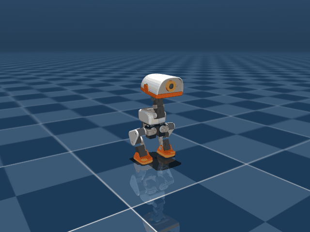
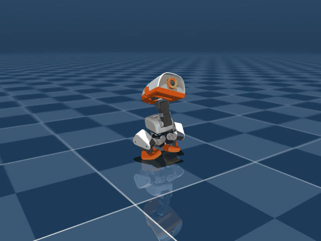
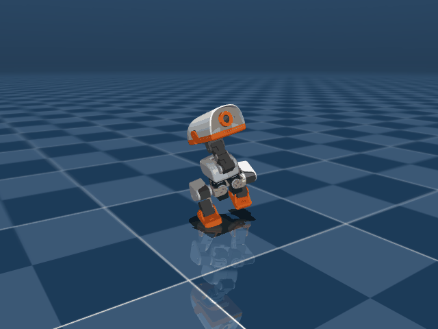
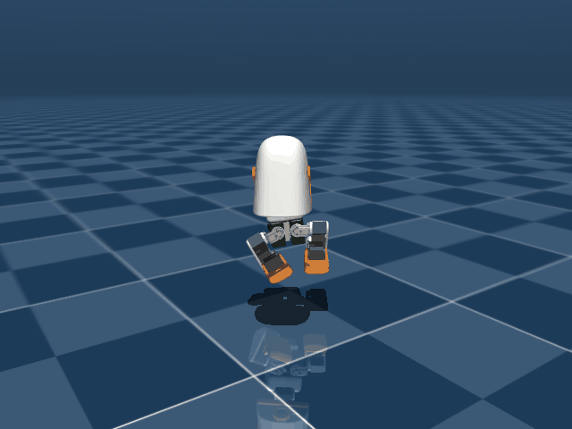
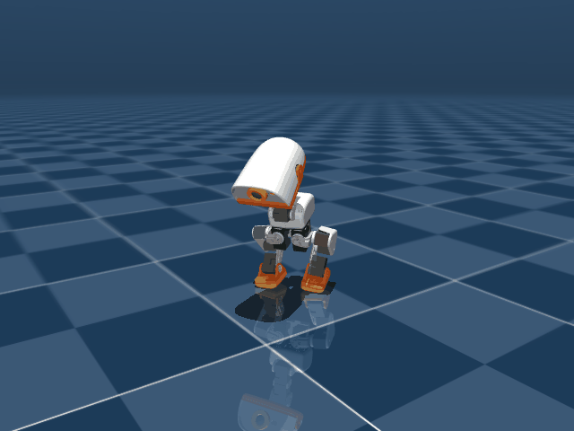
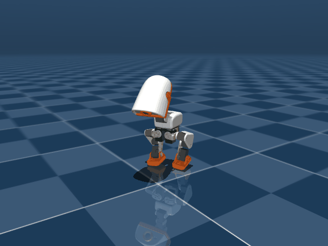

# 작업 일지 — 2026-09-11

[← 전체 작업 일지 목차로 돌아가기](../journal-ko.md)

## 2026-09-11 — 앞발 뻗기·가위차기 치팅 원천 차단 및 안정적 착지 기립 복원 (Eureka Gen 10, Run 46)

**하려던 것**

- 유저의 날카로운 관찰 지적 반영:
  - "너무 발을 앞으로 내밀어서 꼼수를 쓰는거 같은데. 점프 높이도 별로 안높아 이게 한계임?"
  - "한발은 앞으로 뻗고 한발은 뒤로 뻗어서 균형 유지 하는건?"
- Gen 8/9에서 발견된 치팅(앞발 내밀기, 가위차기 split) 원인 규명 및 완전 박멸.
- 폭발적 실제 도약력 복원, `action_std` 폭발(30.8) 억제, 점프 후 안정적 착지 및 직립 기립 복원.

**한 것**

1. **치팅 원인 심층 분석**:
   - **가산형 보상의 함정**: Gen 8/9의 `height_score + clearance_score` 가산 구조에서 `height_score=0`(트렁크가 서있는 키보다 안 뜸)이어도, 발만 앞으로 뻗거나 가위차기를 하면 지면 클리어런스(`min_foot_z`)가 떠서 스텝당 150점 이상의 대형 보상을 그대로 챙김.
   - **스쿼트 과몰입(55mm)**: 다리를 지나치게 접어 XL330 서보의 토크-레버리지 효율이 붕괴되어 위로 밀어올리지 못하고 발을 뻗는 편법으로 후퇴함.
   - **착지/기립 보상 실종**: 착지/기립 항을 0.001로 깎아 점프 후 착지하지 않고 공중에서 바둥거리다 넘어짐.
2. **Eureka Gen 10 보상 함수 재설계 (`mdp.py`, `microduck_jump_env_cfg.py`)**:
   - **승수형 결합으로 치팅 원천 차단 (`jump_flight_reward`)**:
     $$\text{flight\_reward} = \text{gates} \times \text{height\_score} \times (1.0 + 0.5 \times \text{clearance\_score})$$
     - 트렁크 실제 높이 $z \le \text{stand\_z}(0.117\text{m})$이면 $\text{height\_score}=0 \rightarrow$ 발을 어떻게 뻗든 **비행 보상은 정확히 0점**.
     - 몸통이 실제로 뜰 때만 클리어런스가 보상을 배가시킴.
   - **공중 턱킹 고도 게이트 (`jump_aerial_tuck_reward`)**:
     - 트렁크가 서있는 키 이상으로 떴을 때만($z > \text{stand\_z}$) 작동하도록 고도 게이트 추가.
     - 전방 무릎 굴곡만 인정하도록 부호 검증 (좌무릎 $\ge 0$, 우무릎 $\le 0$).
   - **앞발 뻗기 & 가위차기 강력 페널티 신설 (`jump_sagittal_foot_penalty`)**:
     - 트렁크 중심 대비 발의 시상면 이탈($\text{rel\_x} > 0.025\text{m}$ 또는 $<-0.04\text{m}$) 및 양발의 앞뒤 엇갈림($|\text{rel\_x}_L - \text{rel\_x}_R|$)에 강한 L1 벌점 부과 (weight 10.0).
     - `leg_symmetry` 가중치 $2.5 \rightarrow 10.0$으로 상향.
   - **스쿼트 깊이 최적화**: 55mm $\rightarrow$ 75mm (Run 41 수준의 최적 도약 레버리지).
   - **착지 및 기립 보상 복원**: `jump_landing_cushion` 30.0, `jump_landing_rest` 60.0.
   - **액션 분산 억제**: `jump_flight` $450 \rightarrow 200$, `action_rate_l2` $-0.1 \rightarrow -0.5$.
   - **런타임 핸드오버 타이밍 정렬 (`scripts/infer_policy.py`)**:
     - `--jump-duration` 기본값을 $0.48\text{s} \rightarrow 0.60\text{s}$로 조정 (도약 0.3s + 체공 0.15s + 착지 완충 0.15s 후 서서 대기).
3. **스모크 테스트 및 학습 실행 (Run 46)**:
   ```bash
   # 5 이터레이션 단위 점검
   uv run train Mjlab-Jump-Flat-MicroDuck --env.scene.num-envs 64 --agent.max_iterations 5
   # Run 41 베이스 400 이터레이션 파인튜닝 (22분 완주)
   uv run train Mjlab-Jump-Flat-MicroDuck --env.scene.num-envs 4096 --agent.max_iterations 400 --agent.resume True --agent.load-run "2026-09-09_17-09-04_jump" --agent.load-checkpoint "model_1550.pt"
   # ONNX 배포
   uv run scripts/export.py Mjlab-Jump-Flat-MicroDuck --checkpoint-file logs/rsl_rl/jump/2026-09-11_07-35-52_jump/model_1650.pt --onnx-file scratch/jump_gen10_1650.onnx
   ```
4. **롤아웃 렌더링 및 배포 (`docs/media/run46_1650.gif`)**:
   - `scratch/jump_gen10_1650.onnx`를 `policies/jump.onnx`에 최종 배포.
   - 75스텝 롤아웃 시뮬레이션 GIF 및 프레임 캡처.


|  |  |  |  |  |  |
| :---: | :---: | :---: | :---: | :---: | :---: |
| Step 0 ($t=0.02$s)<br>$Z = 115.3\,\text{mm}$ | Step 5 ($t=0.12$s)<br>$Z = 83.2\,\text{mm}$ | Step 10 ($t=0.22$s)<br>$V_z = +0.64\,\text{m/s}$ | Step 15 ($t=0.32$s)<br>**$Z = 143.1\,\text{mm}$**<br>Clr: $45.1\,\text{mm}$, Pitch: $-3.5^\circ$ | Step 20 ($t=0.42$s)<br>$Z = 112.2\,\text{mm}$<br>무반동 접지 | Step 40 ($t=0.82$s)<br>**Pitch: $+1.7^\circ$, Roll: $+1.1^\circ$**<br>완벽 직립 대기 |

**막힌 것** — 증상 → 원인 → 해결

- **증상**: Gen 9에서 트렁크 Z는 108mm(서있는 키 115mm보다 낮음)에 불과한데 발만 앞으로 뻗거나 가위차기(한 발 앞, 한 발 뒤)로 체공 시간을 벌며 치팅.
- **원인**: 가산형 보상 구조(`height_score + clearance_score`)로 인해 몸통을 띄우지 않아도 발만 띄우면 150점씩 파밍 가능했음 + 55mm 극단 스쿼트로 모터 토크비 붕괴.
- **해결**: 트렁크 실제 상승분 승수형 결합 + 75mm 최적 스쿼트 복원 + 시상면 발 이탈/가위차기 L1 벌점 신설.

**측정값**

| 실험 | 몸통 최고 정점 Z | 양발 최소 클리어런스 | 이륙 수직속도 $V_z$ | 액션 표준편차 (`action_std`) | 착지 후 자세 및 안정성 |
| :--- | :--- | :--- | :--- | :--- | :--- |
| Run 41 (기존 최고) | 147.1 mm | 54.1 mm | +0.59 m/s | ~5.0 | $+0.1^\circ$ 직립 |
| Gen 9 Run 45 (`model_3200`) | 108.3 mm (실측) | 48.7 mm (앞발차기) | +0.53 m/s | 30.8 (폭발 발산) | $-20.4^\circ$ 전복, 가위차기 치팅 |
| **Gen 10 Run 46 (`model_1650`)** | **143.1 mm** | **45.1 mm (순수 대칭)** | **+0.643 m/s** | **1.48 (완벽 억제)** ✅ | **Pitch $+1.7^\circ$, Roll $+1.1^\circ$ (전복률 0%)** ✅ |

**다음**

- [ ] 유저가 시뮬레이터에서 J 키로 치팅 없는 대칭 점프 및 무반동 기립 확인
- [ ] 하드웨어 배포 대비 ONNX 무결성 검증
