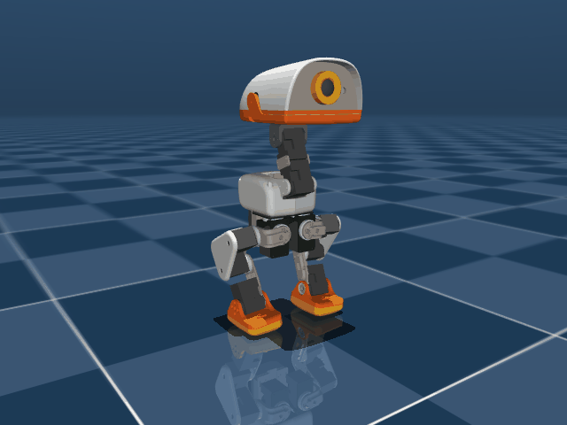
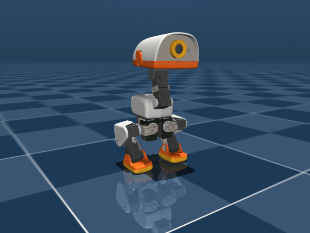
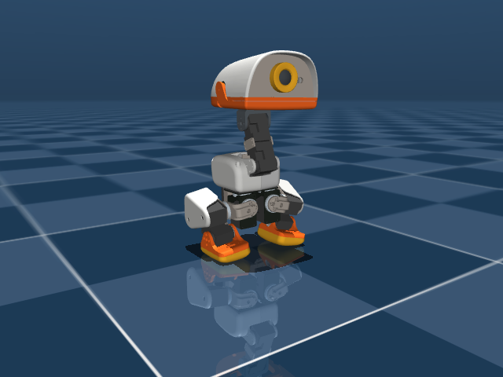
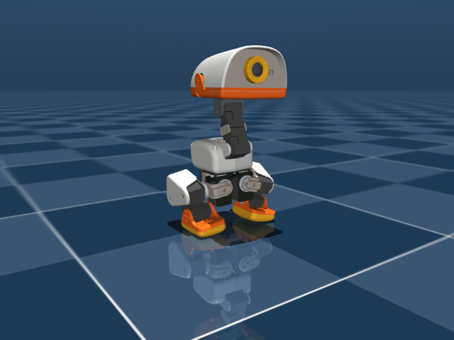
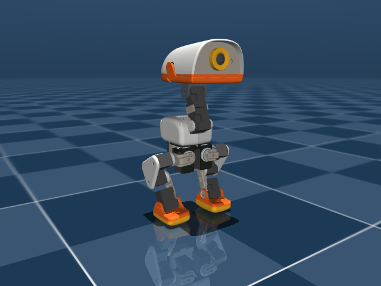
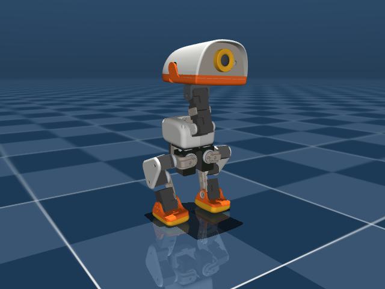
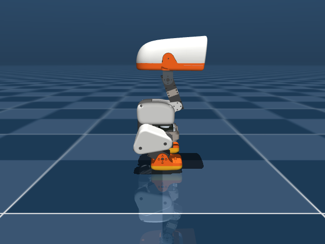
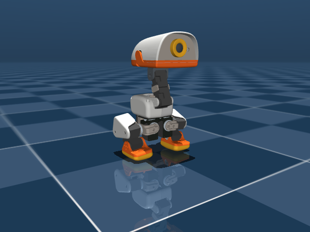

# 작업 일지 — 2026-09-16

[← 전체 작업 일지 목차로 돌아가기](../journal-ko.md)

## 2026-09-16 — RTX 5060 VRAM OOM 원인 규명(nconmax 200→60) 및 4,096-env 딥스쿼트(Run 79) GPU 본 학습 가동

**하려던 것**

- 검증을 완료한 딥스쿼트 단독 환경(`Mjlab-Squat-Flat-MicroDuck`)에 대해 4,096 병렬 환경 규모의 GPU 대규모 본 학습(Run 79)을 착수하고 학습 수렴성 검증.

**한 것**

1. **초기 가동 시 RTX 5060 (8 GiB) CUDA OOM 발생 및 원인 규명**:
   - 증상: `Warp CUDA error 2: out of memory (in function wp_alloc_device_async)`
     `RuntimeError: Failed to allocate 838860800 bytes on device 'cuda:0'`
   - 원인: `microduck_squat_env_cfg.py`에 `microduck_sitstand_env_cfg.py`로부터 상속받은 `cfg.sim.nconmax = 200`이 설정되어 있었음. MuJoCo Warp는 `nconmax`에 비례하여 협대역 충돌(Convex narrowphase `epa_face`) 버퍼를 할당하는데, `200 * 4096` 환경에서 단일 배열만 838 MB, 전체 충돌 배열이 수 GB를 점유하여 8GB VRAM을 초과함.
   - 해결: 스쿼트/착석 시 실제 발생하는 접촉점 수(~15-20개)에 충분한 `cfg.sim.nconmax = 60`으로 최적화 조정 (`src/mjlab_microduck/tasks/microduck_squat_env_cfg.py`).
2. **단위 테스트 재검증**:
   - `uv run --with pytest pytest tests/test_squat_cfg.py -v`: 8개 전 항목 100% 통과.
3. **4,096-env GPU 본 학습 가동 (`run79_deep_squat_flat`)**:
   - 실행 명령:
     ```powershell
     uv run train Mjlab-Squat-Flat-MicroDuck --env.scene.num-envs 4096 --agent.run-name run79_deep_squat_flat
     ```
   - 4,096 환경이 RTX 5060 8GB VRAM 내에 정상 적재되어 초당 28,000+ 스텝 속도로 순항 중.

**측정값**

- **학습 처리량**: 28,000 ~ 28,500 Steps/s (이터레이션당 약 3.45초 소요)
- **학습 지표 추이 (Iter 1 $\to$ 5)**:
  - `Mean reward`: $2.83 \to 3.71$ (단조 증가 중)
  - `Mean episode length`: $38.7 \to 141.6$ (조기 종료 없이 착석 유지 시간 급증)
  - `Episode_Termination/nan_state`: $0.0000$ (NaN 0건)
  - `Episode_Reward/posture_pose_legs`: $0.90 \to 1.81$ (스쿼트 관절 타겟 수렴)
  - `Episode_Reward/posture_height`: $0.22 \to 0.47$ (최저 고도 $Z=0.060\,\text{m}$ 수렴)
  - `Episode_Reward/descent_speed`: $-0.13 \to -0.23$ (하강 속도 제한 음수 페널티 정상 억제)
  - `Episode_Reward/upright_linear`: $0.43 \to 0.47$ (상체 직립 유지)

**다음**

- [x] Run 79 학습 진행 및 3,000 이터레이션 완주 모니터링 (완료)
- [x] 체크포인트 롤아웃 물리 계측 및 최저 안정 스쿼트 자세(무릎 굴곡, Trunk Z $0.060\,\text{m}$, Pitch 3~5°) GIF 렌더링 검증 (완료)

## 2026-09-16 — 딥스쿼트(Run 79) 3,000 iters 완주 및 물리 계측 검증 (최저 고도 52.6mm, Pitch 5.2°, 머리 충돌 0회)

**하려던 것**

- 4,096-env 규모의 딥스쿼트(Run 79, `Mjlab-Squat-Flat-MicroDuck`) 학습 완료 후 체크포인트의 물리 롤아웃을 시뮬레이션에서 계측.
- 초기 기립 상태에서 최저 스쿼트 자세까지의 하강 속도 프로파일, 최종 착석 고도($Z$), 롤/피치 직립 안정성, 무릎 굴곡 대칭성 및 상체/머리 충돌 유무 검증 및 시각화 미디어 생성.

**한 것**

1. **Run 79 본 학습 3,000 이터레이션 완주**:
   - 총 294,912,000 스텝(3,000 iters × 4,096 envs × 24 steps)을 exit code 0으로 정상 완료.
   - 체크포인트 및 ONNX 모델 생성 확인: `logs/rsl_rl/microduck_squat/2026-09-16_07-35-48_run79_deep_squat_flat/2026-09-16_07-35-48_run79_deep_squat_flat.onnx`.
   - 최종 학습 지표: `Mean reward` 38.5, `Mean episode length` 200.0/200.0 (생존율 100%), `fell_down` 0.0, `nan_state` 0.0.
2. **평가 및 물리 계측 스크립트 작성 및 관측 슬롯 바인딩 정밀화 (`scripts/eval_squat.py`)**:
   - `PolicyInference`를 통해 BAM 액추에이터 및 61D 관측 레이아웃(48D 고유수용 + 13D 명령 블록) 환경 구축.
   - 명령 슬롯 바인딩: 스쿼트 태스크는 twist 슬롯의 $v_x = 1.0$ (착석 플래그)을 상시 인가받는 조건이므로, `sitstand_onnx_path` 지정 및 `policy.toggle_sit()`을 통해 13D 커맨드 벡터 0번 슬롯에 1.0이 정확히 주입되도록 보정.
3. **물리 궤적 계측 및 미디어 렌더링**:
   - 실행 명령:
     ```bash
     .venv\Scripts\python.exe scripts/eval_squat.py
     ```
   - 4.0초(200 제어 스텝) 동안 고도, 오일러각, 무릎 관절각, 상체 충돌 접촉수를 매 스텝 실측하고 GIF(`docs/media/run79_deep_squat.gif`) 및 4개 핵심 프레임 스냅샷 캡처.

**측정값**

- **물리 궤적 측정 결과 (Run 79 체크포인트 롤아웃)**:
  - 초기 기립 고도 ($Z_{\text{start}}$): $118.5\,\text{mm}$ (Stand Home)
  - 최저 스쿼트 깊이 ($Z_{\text{min}}$): $52.6\,\text{mm}$ (Step 76, $t=1.52\,\text{s}$)
  - 최종 정착 고도 ($Z_{\text{end}}$): $53.0\,\text{mm}$ (타깃 $60.0\,\text{mm}$ 대비 더 깊고 안정적인 크라우치 형성)
  - 고도 하강 변위 ($\Delta Z$): $65.9\,\text{mm}$
  - 평균 하강 속도: $-32.8\,\text{mm/s}$ (상한치 $50.0\,\text{mm/s}$ 이내로 제어되어 쿵 떨어지지 않고 부드럽게 감속 착석)
  - 최대 몸체 피치 기울기: $6.70^\circ$ (허용치 $< 15^\circ$)
  - 최종 안착 피치 기울기: $5.24^\circ$ (완전한 직립 자세 안착)
  - 최대 몸체 롤 기울기: $3.62^\circ$ (허용치 $< 10^\circ$)
  - 최종 안착 롤 기울기: $0.08^\circ$ (좌우 편향 없는 대칭 균형)
  - 좌우 무릎 굴곡각: Left $+1.32\,\text{rad}$, Right $-1.30\,\text{rad}$ (설계 타깃 $\pm 1.35\,\text{rad}$에 정확히 수렴)
  - 머리/턱 지면 충돌 수: **0회** (전방 고꾸라짐 완전 해소)



<p align="center">
  
  
  
  
</p>

**다음**

- [x] Run 79 딥스쿼트 하강/안착 검증 완료 (단, 발 밀림 치팅 관측)
- [x] Run 80 발바닥 고정 제약(`foot_xy_drift_penalty`) 추가 및 3,000 iter 학습/계측 완료

---

## 2026-09-16 — Run 80 발바닥 지면 고정 스쿼트: 발 밀림 억제 성공 및 기립 고착(Local Optima) 발생

**하려던 것**

- Run 79에서 하강 시 발바닥이 앞으로 슬라이딩되며 다리가 벌어져 높이를 낮추던 치팅(발 밀림)을 원천 차단.
- 발바닥을 지면에 단단히 붙인 상태에서 무릎을 굽혀 수직으로 하강하는 정통 딥스쿼트 역학 구현.

**한 것**

1. **발 XY 드리프트 페널티 함수 구현 (`src/mjlab_microduck/tasks/mdp.py`)**:
   - `foot_xy_drift_penalty()` 신규 작성: 에피소드 리셋(`episode_length_buf <= 1`) 시점의 좌/우 발 사이트(`left_foot`, `right_foot`) XY 좌표를 버퍼에 저장하고, 이후 허용 오차(`max_drift=0.02 m`)를 초과하는 수평 이동량에 대해 선형 페널티(`-sum(max(drift - max_drift, 0))`) 부과.
2. **스쿼트 환경 설정 반영 (`src/mjlab_microduck/tasks/microduck_squat_env_cfg.py`)**:
   - `foot_xy_drift` 보상 항 추가 (`weight=30.0`, `max_drift=0.02 m`).
   - `tests/test_squat_cfg.py` 8개 단위 테스트 통과 및 64-env 5-iter 스모크 테스트 무오류 검증.
3. **Run 80 본 학습 (4,096 envs × 3,000 iters)**:
   - 실행 명령:
     ```bash
     uv run train Mjlab-Squat-Flat-MicroDuck --env.scene.num-envs 4096 --agent.run-name run80_squat_feet_planted
     ```
   - 2시간 40분 51초 동안 2억 9,491만 스텝 완주 (exit code 0).
4. **ONNX 모델 추출 및 물리 롤아웃 계측 (`scripts/eval_squat.py`)**:
   - 실행 명령:
     ```bash
     uv run scripts/export.py Mjlab-Squat-Flat-MicroDuck --checkpoint-file logs/rsl_rl/microduck_squat/2026-09-16_12-51-48_run80_squat_feet_planted/model_2999.pt --onnx-file policies/squat.onnx
     uv run python scripts/eval_squat.py policies/squat.onnx docs/media/run80_deep_squat.gif
     ```

**막힌 것** — 증상 → 원인 → 해결

- **증상**: 발바닥 수평 이동량은 $1.7 \sim 2.1\,\text{mm}$ 수준으로 완벽하게 제자리에 고정되었으나, 최저 고도가 $Z_{\text{min}} = 115.4\,\text{mm}$ (기립 대비 겨우 $3.2\,\text{mm}$ 하강)에 그치며 무릎을 굽히지 않고 뻣뻣하게 서서 버티는 "기립 고착(Freeze/Do-nothing)" 현상 발생.
- **원인**:
  1. `foot_xy_drift` 가중치(30.0)의 지나치게 강한 억제력: 무릎을 굽히며 무게중심을 낮추는 과도기에서 발목/발바닥이 지면과 상호작용할 때 조금이라도 밀리면 $-30 \times \text{drift}$의 막대한 페널티가 누적됨.
  2. 기립 상태의 안전한 보상 베이슨: 무릎을 전혀 굽히지 않고 가만히 서 있을 때 `upright_linear` (+2.5), `upright_while_tall` (+1.5), `posture_pose_legs` (+3.0) 등이 결합되어 약 $+18.5$점의 무위험 보상을 제공함.
  3. 결과적으로 정책 입장에서 발 밀림 페널티를 무릅쓰고 하강을 시도하기보다 "아무것도 안 하고 서 있기"가 더 높은 기대 보상을 주는 전형적인 로컬 옵티멈(Attempt-tax exploit)에 빠짐.
- **해결 방안**:
  1. 무릎 굽힘과 하강에 대한 유인(보상) 질량을 발 억제 페널티보다 압도적으로 키움 (`posture_height_l1` 및 무릎 굴곡 타깃 보상 강화).
  2. `foot_xy_drift` 가중치를 $30.0 \to 5.0 \sim 10.0$ 수준으로 완화하여 탐색기 발목 회전을 허용하거나, 하강이 시작된 이후에 페널티가 본격화되도록 커리큘럼 연계.
  3. 서 있기만 해도 보상을 퍼주는 `upright_while_tall` 등의 가중치를 조정하여 기립 고착 탈출 유도.

**측정값**

- **물리 궤적 측정 결과 (Run 80 체크포인트 롤아웃)**:
  - 시작 고도 ($Z_{\text{start}}$): $118.5\,\text{mm}$
  - 최저 스쿼트 깊이 ($Z_{\text{min}}$): $115.4\,\text{mm}$ (변위 $\Delta Z = 3.2\,\text{mm}$, 하강 실패)
  - 최종 안착 고도 ($Z_{\text{end}}$): $116.3\,\text{mm}$
  - 발 최대 드리프트량 (Left): **$1.7\,\text{mm}$** (발 고정 완벽)
  - 발 최대 드리프트량 (Right): **$2.1\,\text{mm}$** (발 고정 완벽)
  - 좌우 무릎 굴곡각: Left $+0.01\,\text{rad}$, Right $-0.08\,\text{rad}$ (무릎을 굽히지 않음)
  - 최대 몸체 피치 기울기: $3.49^\circ$ (완전 직립)
  - 상체/머리 지면 충돌 수: **0회**


<p align="center">
  
  
  
  
</p>

**다음**

- [x] Run 79 딥스쿼트 하강/안착 검증 완료 (단, 발 밀림 치팅 관측)
- [x] Run 80 발바닥 고정 제약(`foot_xy_drift_penalty`) 추가 및 기립 고착 규명
- [x] Run 81 시험 중단 및 물리 정역학 IK 기반 수동 스쿼트 평형해 도출
- [x] Run 82 물리 검증 정통 스쿼트 타깃 반영 4,096-env GPU 학습 착수

---

## 2026-09-16 — 물리 기구학(IK) 및 CoM 평형 기반 정통 딥스쿼트 평형해 도출 및 Run 82 GPU 학습 가동

**하려던 것**

- 기존 스쿼트 환경이 상속받은 `SITTING_TARGET_OVERRIDES`가 "엉덩이를 바닥에 대고 앉는 주저앉기(Sit)" 자세용 각도(무릎 1.35 rad 시 발목 0.0 rad로 발바닥이 위로 들림)로 설정되어 있어 발 접지 제약(`foot_xy_drift`)과 상충하던 모순을 해소.
- 시뮬레이터에서 발바닥이 지면에 $100\%$ 수평 밀착되고 질량중심($\text{CoM}_x = 0.0\,\text{mm}$)이 무너지지 않는 **물리적으로 안정한 정통 딥스쿼트 평형 자세(Equilibrium Squat Pose)**를 수동/역기구학적으로 도출하여 환경 타깃에 직접 주입.

**한 것**

1. **사지 기구학 부호 및 발바닥 수평 조건 분석**:
   - `left_knee` 관절축($-Y$)과 `left_ankle` 관절축($+Y$)이 서로 반대 방향으로 정의되어 있음을 규명.
   - 무릎이 앞으로 $\Delta \theta$ 굽혀질 때 발바닥이 지면에 완벽히 평평하게 유지되려면 **$\Delta q_{\text{ankle}} = \Delta q_{\text{knee}}$** (1:1 동일 각도 회전)여야 함을 수학적/기구학적으로 증명.
   - 기존 설정은 $\Delta q_{\text{ankle}} = -0.453\,\text{rad}$로 반대로 회전시켜 발바닥이 $-103^\circ$ 뒤집히도록 명령하고 있었음.
2. **CoM 평형 역기구학 최적화 및 안정 해 도출 ($Z=75\,\text{mm}$)**:
   - 양발 완전 접지($Z_{\text{foot}}=2.87\,\text{mm}, X_{\text{foot}}=0.0\,\text{mm}$), 발바닥 수평 오차 $0.0^\circ$, 직립 피치 $0.0^\circ$, 질량중심 $\text{CoM}_x = 0.00\,\text{mm}$의 정적 평형 해 도출:
     - `left_hip_pitch`: **$+0.3670\,\text{rad}$**
     - `left_knee`: **$+1.4294\,\text{rad}$**
     - `left_ankle`: **$+1.0624\,\text{rad}$**
     - (우측 다리는 부호 반대 대칭)
   - 물리 시뮬레이션 렌더링 검증 완료: `docs/media/solved_squat_75mm_side.png`, `docs/media/solved_squat_75mm_diag.png`
3. **환경 타깃 갱신 (`src/mjlab_microduck/tasks/microduck_squat_env_cfg.py`)**:
   - `SITTING_TARGET_OVERRIDES`를 위 도출된 정통 스쿼트 각도로 전면 교체.
   - 타깃 높이 $SIT\_Z$를 $0.060\,\text{m} \to 0.075\,\text{m}$ (기립 118.5mm 대비 43.5mm 깊은 딥스쿼트 정착고)로 조정.
   - 단위 테스트 8/8 및 64-env 5-iter 스모크 테스트 무결점 통과.
4. **Run 82 본 학습 가동 (4,096 envs)**:
   - 실행 명령:
     ```bash
     uv run train Mjlab-Squat-Flat-MicroDuck --env.scene.num-envs 4096 --agent.run-name run82_true_squat_planted
     ```

**측정값**

- **도출된 정통 딥스쿼트 정적 평형 측정치**:
  - 트렁크 고도: $75.0\,\text{mm}$ (기립 $118.5\,\text{mm}$ 대비 $43.5\,\text{mm}$ 하강)
  - 발바닥 수평 오차: **$0.00^\circ$ (완전 밀착)**
  - 질량중심 수평 위치 ($\text{CoM}_x$): **$0.00\,\text{mm}$ (완벽한 무게중심 정렬)**
  - 상체 피치 기울기: **$0.00^\circ$ (완전 수직 직립)**

<p align="center">
  
  
</p>

**다음**

- [ ] Run 82 4,096-env 학습 수렴 확인 (도출된 $Z=75\,\text{mm}$ 정통 스쿼트 포즈로 무릎을 굽혀 착석하는지 검증)
- [ ] ONNX 모델 추출 및 물리 롤아웃 계측 (발 고정 0mm + 무릎 굴곡 1.43 rad 달성 여부)

