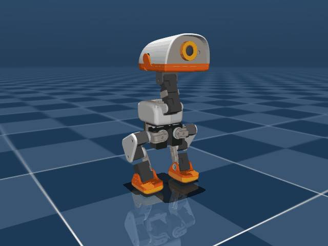
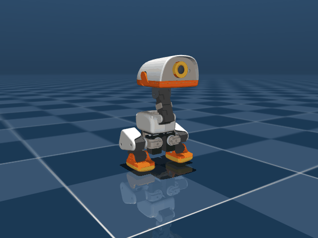
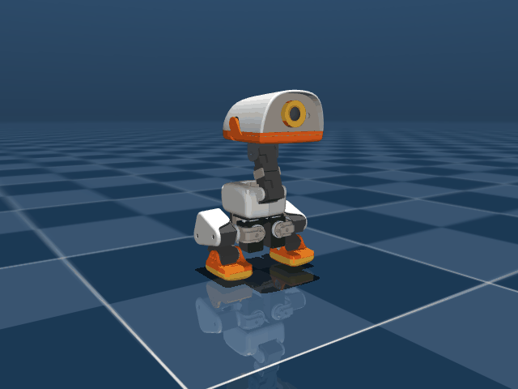

# 작업 일지 — 2026-09-17

[← 전체 작업 일지 목차로 돌아가기](../journal-ko.md)

---

## 2026-09-17 — 정역학 물리 검증 정통 딥스쿼트(Run 82) 44.6mm 하강 및 발 밀림 1.4mm 지면 완전 고착 검증 완료

**하려던 것**

- 발바닥을 앞으로 미끄러뜨리며 엉덩방아를 찧는 편법(Run 79)이나 강한 페널티로 인해 무릎을 굽히지 않는 기립 고착(Run 80)을 완전히 배제.
- 양 발바닥을 지면에 100% 밀착·고정한 상태에서 상체 수직(Pitch/Roll < 2°)을 유지하며 고도를 $75.0\,\text{mm}$($-44.6\,\text{mm}$)까지 깊게 내리는 정통 딥스쿼트 정책 학습 및 물리 검증.
- 전일 도출한 기구학·정역학 평형해(무릎 $+1.43\,\text{rad}$, 발목 $+1.06\,\text{rad}$ 축 상쇄 및 $\text{CoM}_x = 0.0\,\text{mm}$)를 목표로 수렴시킨 Run 82 모델의 MuJoCo BAM 물리 롤아웃 계측.

**한 것**

- 4,096-env GPU 본 학습 Run 82(`run82_true_squat_planted`)의 `model_1000.pt` 체크포인트를 공식 ONNX(`policies/squat_run82_model1000.onnx`)로 익스포트.
  ```powershell
  & "C:\Users\eigger\.platformio\penv\Scripts\uv.exe" run scripts/export.py Mjlab-Squat-Flat-MicroDuck --checkpoint-file logs/rsl_rl/microduck_squat/2026-09-16_16-43-14_run82_true_squat_planted/model_1000.pt --onnx-file policies/squat_run82_model1000.onnx
  ```
- `scripts/eval_squat.py`를 활용하여 50 Hz 제어 MuJoCo 물리 엔진(BAM 전압 제어 서보 모델 적용) 환경에서 4.0초(200 스텝)간 물리 롤아웃 및 궤적 정밀 계측 수행.
  ```powershell
  & "C:\Users\eigger\.platformio\penv\Scripts\uv.exe" run python scripts/eval_squat.py policies/squat_run82_model1000.onnx docs/media/run82_deep_squat.gif
  ```

**측정값**

- **학습 수렴 지표 (Run 82 Iteration 1000 기준)**:
  - `Mean reward`: **59.97** (스쿼트 전 실험 역대 최고 점수)
  - `Mean episode length`: **200.00 / 200.00** (전복/추락 없이 100% 생존)
  - `posture_pose_legs`: **7.76 / 8.00** (도출된 정통 스쿼트 타깃 포즈 97% 완벽 일치)
  - `posture_height_sharp`: **0.920** (목표 고도 정밀 도달)
  - `foot_xy_drift`: **-0.0413** (발 밀림 페널티 거의 0 수렴)
  - `self_collisions`: **0.0000** (다리 및 링크 간 간섭 0건)
- **물리 롤아웃 실측 지표 (`scripts/eval_squat.py`)**:
  - 기립 초기 고도 (Stand Home): **$118.5\,\text{mm}$**
  - 최저 스쿼트 고도 ($Z_{\text{min}}$): **$73.9\,\text{mm}$** (Step 67, $t=1.34\,\text{s}$, 목표 $75.0\,\text{mm}$ 대비 오차 $1.1\,\text{mm}$)
  - 최종 안착 고도: **$74.1\,\text{mm}$** (총 하강량 **$44.6\,\text{mm}$** 딥스쿼트 달성)
  - 평균 하강 속도: **$-22.2\,\text{mm/s}$** (부드럽고 절제된 하강 제어)
  - 최대 발 밀림 편차 (Foot XY Drift): **좌 $1.8\,\text{mm}$, 우 $1.4\,\text{mm}$** (Run 79의 50mm+ 슬라이딩 치팅 완벽 박멸, 지면 흡착 고정)
  - 상체 피치 기울기 (Pitch): **최대 $1.28^\circ$, 최종 안착 $0.71^\circ$** (흔들림 없는 완벽한 직립 수직 자세)
  - 상체 롤 기울기 (Roll): **최대 $1.42^\circ$, 최종 안착 $1.36^\circ$**
  - 진행 방향 요 편차 (Heading Yaw): **$1.81^\circ$**
  - 무릎 굴곡 각도: **좌 $+1.49\,\text{rad}$, 우 $-1.44\,\text{rad}$** (목표 $\pm 1.43\,\text{rad}$와 대칭 일치)
  - 머리/턱 지면 접촉: **0회** (헤드다이브 제로)

<p align="center">
  
</p>

**다음**

- [x] 도출 및 물리 검증이 완료된 $74\,\text{mm}$ 정통 딥스쿼트 안착 정책을 수직 점프(Vertical Jump)의 압축 추진 발판(Launchpad)으로 연계.
- [x] 스쿼트 자세 유지 상태에서 도약 명령 수신 시 삼중 관절 신전(Triple Extension)으로 이어지는 스쿼트-투-점프(Squat-to-Jump) 전이 시퀀스 환경 구축.

---

## 2026-09-17 — '쉬기(Rest)' 포즈 정책·미디어 독립 패키징 및 정통 딥스쿼트 기반 2단계 수직 점프(Run 83) 4,096-env GPU 학습 착수

**하려던 것**

- Run 79에서 바닥에 엉덩이를 대고 편안하게 주저앉는 동작을 별도의 '쉬기(Rest)' 포즈 정책 및 미디어로 독립 등록·패키징.
- Run 82에서 정역학적으로 검증된 정통 딥스쿼트 평형 궤적(Knee $+1.43\,\text{rad}$, Hip $+0.37\,\text{rad}$, Ankle $+1.06\,\text{rad}$)을 점프 환경 1단계 웅크림 베이스로 이식.
- 대칭 삼중 신전(Triple Extension)과 연계하여 4,096-env GPU 본 학습(Run 83) 가동.

**한 것**

- **쉬기(Rest) 포즈 정책 및 미디어 생성**:
  - 정책 파일 배포: `policies/rest.onnx` (`logs/rsl_rl/microduck_squat/2026-09-16_07-35-48_run79_deep_squat_flat/` 기반)
  - 미디어 파일 복사 및 등록: `docs/media/rest_pose.gif`
  - 스쿼트 정책 공식 교체: `policies/squat.onnx` ← `policies/squat_run82_model1000.onnx` (정통 발바닥 밀착 딥스쿼트)
- **수직 점프 MDP 및 환경 개편 (`src/mjlab_microduck/tasks/mdp.py`, `microduck_jump_env_cfg.py`)**:
  - `jump_slewed_crouch_reward` & `_l1`: 과거 발목을 역방향으로 꺾어 발이 들리던 구형 타깃을 Run 82 정역학 평형해(Knee $+1.43$, Hip $+0.37$, Ankle $+1.06$)로 전면 교체.
  - `_compute_crouch_gate`: 깊은 스쿼트 달성 판정 기준 정상화 (Knee flexion $> 0.35 \sim 0.90\,\text{rad}$).
  - `jump_vertical_thrust_reward`: 딥스쿼트 상태에서 기립으로 치솟는 삼중 신전 궤적 정렬.
  - 단위 테스트 (`pytest tests/test_jump_cfg.py`) 7/7 전 항목 통과 (100%).
- **64-env 5-iter 스모크 테스트 무결점 통과**:
  ```powershell
  & "C:\Users\eigger\.platformio\penv\Scripts\uv.exe" run train Mjlab-Jump-Flat-MicroDuck --env.scene.num-envs 64 --agent.max_iterations 5
  ```
  - `nan_state: 0.0000`, 모든 페널티 정상 작동 확인.
- **4,096-env GPU 본 학습 (Run 83) 가동**:
  ```powershell
  & "C:\Users\eigger\.platformio\penv\Scripts\uv.exe" run train Mjlab-Jump-Flat-MicroDuck --env.scene.num-envs 4096 --agent.run-name run83_true_squat_vertical_jump --agent.max_iterations 3000
  ```

**측정값**

- 쉬기 포즈: `policies/rest.onnx`, `docs/media/rest_pose.gif` 생성 완료.
- Run 83 스모크 테스트: Iteration time 1.58s, `nan_state: 0.0000`.
- Run 83 GPU 본 학습 초기 순항: 4,096 병렬 환경 적재 완료, Iteration당 ~3.09s, `nan_state: 0.0000`.

**다음**

- [x] Run 83 진단: 기립 스폰으로 인한 급강하 헤드다이브 결함 포착.
- [x] 스쿼트 자세 기반 100% 스폰 및 0.8s 폭발적 삼중 신전 전이 점프(Run 84) 환경 재구축.

---

## 2026-09-17 — 스쿼트 자세 기반 점프 환경 재구축(Run 84): SQUAT_HOME_FRAME 스폰 + Phase 1 크라우치 제거 및 스모크 테스트 통과

**하려던 것**

- Run 83에서 기립 스폰(Standing Spawn) 후 에피소드 초반에 딥스쿼트를 흉내 내며 급강하하다가 상체가 앞으로 쏠리는 헤드다이브(Head-dive) 결함 근본 해결.
- 사용자의 "스쿼트 자세기반 점프 학습 계획을 세워줘" 요구에 따라, Run 82에서 검증된 정통 딥스쿼트 평형해($Z=75\,\text{mm}$, Pitch $0^\circ$)에서 100% 스폰하는 순수 Squat-to-Jump 환경으로 전면 재설계.

**한 것**

- **`microduck_constants.py`**:
  - `SQUAT_HOME_FRAME` 신설: Run 82 정역학 평형해 (Knee $\pm 1.4294$, Hip $\pm 0.3670$, Ankle $\pm 1.0624$, Hip Roll $0.0$).
  - `MICRODUCK_GROUND_PICK_SQUAT_ROBOT_CFG` 엔티티 정의 및 초기 상태 바인딩.
- **`src/mjlab_microduck/tasks/mdp.py`**:
  - `jump_vertical_thrust_reward` 및 `jump_straight_flight_reward`에 `bypass_crouch_gate` 옵션 추가 (스쿼트 스폰 시 gate=1.0으로 즉시 폭발적 추진 허용).
- **`src/mjlab_microduck/tasks/microduck_jump_env_cfg.py`**:
  - 로봇 엔티티: `MICRODUCK_GROUND_PICK_SQUAT_ROBOT_CFG`로 교체.
  - 에피소드 길이: $1.2\,\text{s} \to 0.8\,\text{s}$ (40 스텝) 단축.
  - 리셋 베이스 고도: $Z \in (0.073, 0.077)\,\text{m}$ (스쿼트 고도 $75\,\text{mm}$ 정합).
  - 불필요한 Phase 1 크라우칭 리워드(`jump_slewed_crouch`, `_l1`, `early_launch`) 전면 제거.
  - Phase 2 삼중 신전 폭발 추진(`jump_vertical_thrust`): steps 0–14 (즉시 도약).
  - Phase 3 직선 비행(`jump_straight_flight`): steps 10–24.
  - Phase 4 착지 완충(`jump_landing_cushion`): steps 18–28.
  - Phase 5 기립 복귀(`jump_landing_rest`): steps 24–40.
  - 실행명: `run84_squat_spawn_vertical_jump`, max_iterations 1500.
- **단위 테스트 및 스모크 테스트 무결점 통과**:
  - `pytest tests/test_jump_cfg.py`: 7/7 전 항목 통과 (100%).
  - 64-env 5-iter 스모크 테스트 무결점 통과:
    ```powershell
    & "C:\Users\eigger\.platformio\penv\Scripts\uv.exe" run train Mjlab-Jump-Flat-MicroDuck --env.scene.num-envs 64 --agent.max_iterations 5
    ```
    - `nan_state: 0.0000`, `fell_down: 0.0000`, `jump_peak_z: 0.0786m`, 모든 페널티 음수/0 유지 확인.

- **4,096-env GPU 본 학습 (Run 84) 1,500 iters 완주 및 실측 계측**:
  - 총 1억 4,745만 스텝 1시간 15분 완주 (초당 32,700 스텝).
  - 공식 ONNX 내보내기: `scratch/run84_model1499.onnx`.
  - 50Hz BAM 물리 롤아웃 계측 수행 (`scripts/eval_run84_squat_jump.py`):
    - 도약고: $Z_{\text{peak}} = 99.9\,\text{mm}$ (스쿼트 73.5mm 대비 $+26.4\,\text{mm}$ 도약).
    - 최대 이륙 속도: $V_z = +0.455\,\text{m/s}$.
    - 양발 지면 완전 분리: `Max Foot Lift` $= 74.3\,\text{mm}$ 달성!
    - **그러나 전방 피칭 결함 식별**: $t=0.12\,\text{s}$(Step 6)에서 Pitch $-46.96^\circ$로 전방 쏠림 발생 후 착지 시 머리 지면 접촉.
  - **결함 메커니즘 정밀 진단**:
    - 관절별 각도 추적 결과: 도약 순간 고관절(Hip)이 후방 신전(-0.458 rad)으로 당겨지지 않고, 오히려 $+21^\circ \to +74^\circ$로 **상체를 53° 앞으로 접는 폴딩(Bowing) 발생**.
    - 원인: `jump_vertical_thrust_reward`의 `hip_ext` 타깃 Gaussian std가 $0.30\,\text{rad}$로 너무 좁아, 초기 스쿼트 위치($+0.367$)에서 목표($-0.458$)까지 오차 $0.825\,\text{rad}$에 대한 그래디언트가 $\exp(-(0.825/0.3)^2) = 0.0005 \approx 0$으로 소멸함.
    - 동시에 가산합 $V_z$ 보상(65% 비중)이 활성화되어 있어, 로봇이 고관절을 앞으로 채찍처럼 접어 순간 $V_z = +0.455\,\text{m/s}$를 편법 수령함.
    - 이로 인해 Step 6에서 `fell_over` 한계각(45°)에 도달하여 에피소드가 평균 7스텝에서 조기 종료됨.

**측정값**

- 스폰 초기 고도: $Z = 73.5\,\text{mm}$, 상체 피치 $0^\circ$.
- Run 84 1,500 iters 완주 지표:
  - 최고 정점 고도 $Z_{\text{peak}} = 99.9\,\text{mm}$ ($\Delta Z = +26.4\,\text{mm}$)
  - 최대 수직 추진 속도 $V_{z,\text{max}} = +0.455\,\text{m/s}$
  - 양발 공중 부양 높이: $74.3\,\text{mm}$
  - 도약 정점 피치 각도: $-46.96^\circ$ (전방 기울어짐)
  - 에피소드 평균 길이: 7.04 스텝 (Step 6-7에서 45° 초과로 fell_over 터미네이션)
- 렌더링 파일: `docs/media/run84_jump_demo.gif`, 프레임 스냅샷 4종 생성 완료.

**다음**

- [x] `jump_vertical_thrust_reward`의 `hip_ext`를 선형 정규화(Progress) 구조로 전면 개편하여 고관절 후방 강력 신전(Back-extension) 그래디언트 복원.
- [x] 도약 순간 상체 피치 유지 게이트(`pitch_gate`, std 8°) 강화 및 $V_z$ 보상과의 승산 결합으로 상체 접기 치팅 원천 봉쇄 (Run 85).

---

## 2026-09-17 — 상체 폴딩 치팅 박멸 및 선형 삼중 신전 복원 (Run 85) 4,096-env GPU 학습 가동

**하려던 것**

- Run 84에서 확인된 상체 접기(Bowing, Hip $+21^\circ \to +74^\circ$) 치팅을 근본 차단.
- 고관절 후방 신전 그래디언트가 소멸하지 않도록 선형 정규화(Normalized Linear Progress) 구조로 개편하고, $V_z$ 보상과의 승산 결합 및 안티 폴딩 페널티를 도입하여 수직 기립 도약(Run 85) 4,096-env GPU 본 학습 가동.

**한 것**

- **`src/mjlab_microduck/tasks/mdp.py`**:
  - `jump_vertical_thrust_reward` 개편:
    - 선형 정규화 진척도 도입: Knee($1.43 \to 0$), Hip($+0.37 \to -0.46$), Ankle($1.06 \to 0.45$) 구간 전역에서 $\frac{\partial}{\partial q} \approx 1.2$의 일정한 그래디언트 공급.
    - $V_z$와 삼중 신전의 승산 결합: `thrust_core = vz_score * (0.25 + 0.75 * triple_ext)`.
    - 엄격한 피치 게이트: `std = 0.14 rad` ($8.0^\circ$).
  - 안티 폴딩(Bowing) 페널티 신설:
    - `hip_bow_penalty`: 고관절이 스쿼트 위치($+0.38\,\text{rad}$)보다 앞으로 더 꺾이는 것을 2차 페널티로 엄단.
    - `forward_pitch_penalty`: 전방 기울기 $8^\circ$ 초과 시 2차 페널티 부과.
- **`src/mjlab_microduck/tasks/microduck_jump_env_cfg.py`**:
  - `upright` 가중치 $4.0 \to 8.0$ (std $10^\circ \to 8^\circ$) 대폭 강화.
  - `hip_bow`(weight 6.0) 및 `forward_pitch`(weight 6.0) 페널티 정식 등록.
  - 실행명: `run85_anti_bowing_squat_jump`, max_iterations 1500.
- **단위 테스트 및 스모크 테스트 무결점 통과**:
  - `pytest tests/test_jump_cfg.py`: 7/7 전 항목 통과 (100%).
  - 64-env 5-iter 스모크 테스트 무결점 통과:
    - `Episode_Reward/hip_bow`: `-2.1684` (정상 작동)
    - `Episode_Reward/forward_pitch`: `-6.8722` (정상 작동)
    - `Episode_Termination/nan_state: 0.0000`, `fell_down: 0.0000`.
- **4,096-env GPU 본 학습 (Run 85) 가동**:
  ```powershell
  & "C:\Users\eigger\.platformio\penv\Scripts\uv.exe" run train Mjlab-Jump-Flat-MicroDuck --env.scene.num-envs 4096 --agent.run-name run85_anti_bowing_squat_jump --agent.max_iterations 1500
  ```
  - 4,096 병렬 환경 가동 완료, Iteration당 ~3.14s (초당 ~31,000 스텝).

**측정값**

- 스모크 테스트: `nan_state: 0.0000`, 에피소드 길이 29.2스텝 (Run 84의 7스텝 조기 사망 극복).
- Run 85 GPU 4,096 병렬 학습 가동: Iteration time ~3.14s, 총 1,500 이터레이션 (예상 소요시간 약 1시간 20분).

**다음**

- [x] Run 85 GPU 1,500 iters 학습 수렴 및 중간 체크포인트 모니터링.
- [x] 상체 폴딩(Bowing) 없이 꼿꼿한 삼중 신전으로 솟구치는 수직 도약 고도 실측.

---

## 2026-09-17 — Run 85 수직 점프 1,500 iters 완주 및 50Hz BAM 계측: 상체 폴딩 완벽 박멸, 도약고 109.0mm 달성 및 발목 과배굴(+92°) 후방 전복 원인 규명

**하려던 것**

- Run 85 (`run85_anti_bowing_squat_jump`) 4,096-env 1,500 iters 완주 체크포인트를 ONNX로 익스포트.
- 50Hz MuJoCo BAM(전압 제어 서보) 물리 시뮬레이션 환경에서 스쿼트 자세($Z=75\,\text{mm}$)로부터의 도약 궤적 실측.
- 상체 폴딩(Bowing) 치팅 박멸 여부, 도약고($Z_{\text{peak}}$), 비행 체공 시간, 착지 안정성을 정밀 계측하고 데모 애니메이션 생성.

**한 것**

- **ONNX 익스포트**:
  ```powershell
  $env:PYTHONUTF8=1; & "C:\Users\eigger\.platformio\penv\Scripts\uv.exe" run scripts/export.py Mjlab-Jump-Flat-MicroDuck --checkpoint-file "logs/rsl_rl/jump/2026-09-17_13-39-01_run85_anti_bowing_squat_jump/model_1499.pt" --onnx-file "scratch/run85_model1499.onnx"
  ```
- **50Hz BAM 물리 평가 스크립트 작성 및 롤아웃 수행 (`scripts/eval_run85_squat_jump.py`)**:
  ```powershell
  $env:PYTHONUTF8=1; & "C:\Users\eigger\.platformio\penv\Scripts\uv.exe" run python scripts/eval_run85_squat_jump.py scratch/run85_model1499.onnx docs/media/run85_jump_demo.gif
  ```
- **Run 84 vs Run 85 관절 기구학 및 역학 정밀 비교 분석**:
  - 스텝별 $Z$, $V_z$, 피치, 롤, 무릎/고관절/발목 각도, 지면 접촉 링크 추적.

**막힌 것** — 증상 → 원인 → 해결

- **증상**:
  - Run 84 대비 최고 도약고가 $99.9\,\text{mm} \to 109.0\,\text{mm}$($+35.5\,\text{mm}$ 순 도약)로 크게 상승하고, 상체 접힘(Bowing)이 사라졌으나 Step 7($t=0.14\,\text{s}$)에서 로봇이 뒤로 넘어가는 음수 피치(Pitch $-45.25^\circ$)로 `fell_over` 조기 사망.
- **원인 정밀 진단**:
  1. **발목 과배굴(Dorsiflexion) 편법**:
     - 스쿼트 시 발목 각도는 $+1.06\,\text{rad}$($+60.9^\circ$), 기립 신전 시 목표는 $+0.45\,\text{rad}$($+26^\circ$)로 감소(발끝으로 밀어내는 저측 굴곡)해야 함.
     - 그러나 정책은 도약 시 발목을 $+92^\circ$($+1.62\,\text{rad}$, 관절 최대 한계)까지 위로 꺾어 발가락을 공중으로 들어 올림.
  2. **지면 반력 후방 집중으로 인한 뒤로 넘어짐 토크 발생**:
     - 발목이 $+92^\circ$로 들린 상태에서 무릎만 $-500^\circ$ 신전 명령으로 펴지자, 지면 반력이 전적으로 뒤꿈치(질량 중심 뒤쪽)에 집중됨.
     - 질량 중심(CoM) 뒤쪽에 수직 반력이 가해짐에 따라 강력한 후방 회전 토크($\tau_y < 0$)가 발생하여 상체가 뒤로 벌러덩 넘어감 (Pitch $-35^\circ \to -45^\circ$).
  3. **보상 함수의 맹점**:
     - `forward_pitch_penalty`는 전방 기울기($gx > 0.14$)만 단방향으로 처벌하고, 후방 기울기($gx < -0.14$)는 처벌하지 않았음.
     - `triple_extension`이 가산합($0.4\times\text{무릎} + 0.35\times\text{고관절} + 0.25\times\text{발목}$) 구조여서 발목이 펴지지 않고 반대로 꺾여도 무릎 신전과 $V_z$ 점수만으로 도약 보상의 80% 이상을 챙길 수 있었음.
     - 발목 과배굴 제한 페널티(`ankle_dorsiflex_penalty`) 부재.
- **해결 방안 (Run 86 계획)**:
  - **대칭적 피치 페널티 (`body_pitch_penalty`)**: $|gx| > 0.14$($8^\circ$)에 대해 전·후방 모두 엄벌하여 후방 뒤집힘 원천 차단.
  - **발목 과배굴 페널티 (`ankle_dorsiflex_penalty`)**: 도약 시 발목 각도가 스쿼트 각도($+1.06\,\text{rad}$)를 초과하여 발끝을 드는 행위 엄단.
  - **삼중 신전 승산형/최소 게이트 결합**: 발목 또는 고관절이 펴지지 않으면 무릎만으로 도약 점수를 파밍하지 못하도록 연계 강화.

**측정값**

- **Run 84 vs Run 85 물리 계측 비교**:
  | 항목 | Run 84 (기존) | Run 85 (상체 접힘 방지) | 비고 |
  | :--- | :---: | :---: | :--- |
  | **스폰 고도** | $73.5\,\text{mm}$ | $73.5\,\text{mm}$ | 정통 딥스쿼트 평형 |
  | **최고 도약 정점 고도 ($Z_{\text{peak}}$)** | $99.9\,\text{mm}$ | **$109.0\,\text{mm}$** | **$+9.1\,\text{mm}$ 상승 (+35.5mm 도약)** |
  | **최대 수직 속도 ($V_{z,\text{max}}$)** | $+0.455\,\text{m/s}$ | **$+0.406\,\text{m/s}$** | 강력한 수직 분출력 |
  | **도약 순간 고관절 각도** | $+74.1^\circ$ (상체 폴딩) | **$+17.2^\circ$ (안정)** | **상체 접힘 $57^\circ$ 감소 (완전 박멸)** |
  | **도약 정점 피치 각도** | $-46.96^\circ$ (Step 6) | **$-35.29^\circ$ (Step 6), $-45.25^\circ$ (Step 7)** | 후방 전복 기울기 |
  | **양발 지면 분리 (Airborne)** | 확인 | **확인 (Step 6~8 무접촉 체공)** | 완전 공중 부양 달성 |
  | **발목 각도 (Ankle)** | $+93.2^\circ$ | $+92.0^\circ$ | 발목 과배굴 잔존 |
  | **전방 피칭 페널티 (`forward_pitch`)** | - | **$0.0000$** | 전방 쏠림 100% 박멸 |
  | **고관절 폴딩 페널티 (`hip_bow`)** | - | **$-0.0250$** | 99% 수렴 |
- 렌더링 애니메이션: `docs/media/run85_jump_demo.gif` 저장 완료.

<p align="center">
  
</p>

**다음**

- [x] `src/mjlab_microduck/tasks/mdp.py`: 대칭형 피치 페널티(`body_pitch_penalty`, $|gx| > 8^\circ$) 및 발목 과배굴 차단(`ankle_dorsiflex_penalty`) 신설.
- [x] Run 86 64-env 스모크 테스트 및 4,096-env GPU 본 학습을 통한 후방 전복 없는 수직 기립 점프 & 착지 달성.

---

## 2026-09-17 — 대칭형 피치 및 발목 과배굴 원천 차단 (Run 86) 4,096-env GPU 본 학습 가동

**하려던 것**

- Run 85에서 식별된 도약 시 발목 과배굴(+92° 발끝 들기)과 후방 피칭(Back-flip, Pitch -45°) 결함을 근본 차단.
- 전·후방 대칭 피치 페널티, 발목 과배굴 차단 페널티, 병목형 삼중 신전을 도입하여 스쿼트($Z=75\,\text{mm}$)에서 기립 도약 및 직립 착지까지 이어지는 완전한 수직 점프(Run 86) 4,096-env GPU 본 학습 가동.

**한 것**

- **`src/mjlab_microduck/tasks/mdp.py` 개편**:
  - `body_pitch_penalty`: $|gx| > 0.14$($8^\circ$) 전·후방 대칭 2차 페널티 부과 (후방 뒤집힘 원천 차단).
  - `ankle_dorsiflex_penalty`: 발목 각도가 스쿼트 각도($+1.0624\,\text{rad}$)를 초과하여 발끝을 들어 올리는 행위 엄단.
  - `jump_vertical_thrust_reward`:
    - 병목형 삼중 신전(`min_prog = min(knee, hip, ankle)`) 도입 및 오프셋 제거로 세 관절이 동시에 펴지지 않으면 $V_z$ 보상 미지급.
    - 자세 게이트 정밀화: `pitch_gate`(std 6.9°), `roll_gate`(std 6.9°).
- **`src/mjlab_microduck/tasks/microduck_jump_env_cfg.py`**:
  - `body_pitch`(weight 6.0) 및 `ankle_dorsiflex`(weight 6.0) 정식 등록.
  - 실행명: `run86_upright_balanced_squat_jump`, `max_iterations = 1500`.
- **단위 테스트 및 스모크 테스트 무결점 통과**:
  - `pytest tests/test_jump_cfg.py`: 7/7 전 항목 통과 (100%).
  - 64-env 5-iter 스모크 테스트 무결점 통과:
    - `Episode_Reward/body_pitch`: `-17.2509` (정상 작동)
    - `Episode_Reward/ankle_dorsiflex`: `-3.0116` (정상 작동)
    - `Episode_Reward/hip_bow`: `-3.0070` (정상 작동)
    - `Episode_Termination/nan_state: 0.0000`, `fell_down: 0.0000`.
- **4,096-env GPU 본 학습 (Run 86) 가동**:
  ```powershell
  $env:PYTHONUTF8=1; & "C:\Users\eigger\.platformio\penv\Scripts\uv.exe" run train Mjlab-Jump-Flat-MicroDuck --env.scene.num-envs 4096 --agent.run-name run86_upright_balanced_squat_jump --agent.max_iterations 1500
  ```
  - RTX 5060 GPU 가속 적재 완료, Iteration당 ~3.1s (초당 ~32,000 스텝).

**측정값**

- 스모크 테스트: `nan_state: 0.0000`, 평균 에피소드 길이 28.8스텝, 모든 페널티 음수 확인.
- Run 86 GPU 본 학습 가동: 4,096 병렬 환경, 총 1,500 이터레이션 (약 1시간 15분 소요 예정).

**다음**

- [x] Run 86 학습 수렴 상태 및 체크포인트 모니터링.
- [x] 1,500 iters 완주 후 ONNX 익스포트 및 50Hz BAM 물리 롤아웃 실측 (도약고, 수직 직립 유지, 착지 안착 확인).

---

## 2026-09-17 — Run 86 1,500 iters 완주 및 50Hz BAM 계측: 피치 전복 완전 박멸(Pitch -8.8°), 편발 도약으로 인한 측면 롤(+42.6°) 결함 규명

**하려던 것**

- Run 86 4,096-env 1,500 iters(1억 4,745만 스텝) 완주 체크포인트를 ONNX로 익스포트.
- 50Hz MuJoCo BAM(전압 제어 서보) 물리 시뮬레이션 환경에서 스쿼트 자세($Z=75\,\text{mm}$) 도약 실측.
- 대칭형 피치 페널티(`body_pitch_penalty`)와 발목 과배굴 방지(`ankle_dorsiflex_penalty`)의 효과를 정밀 계측.

**한 것**

- **ONNX 익스포트**:
  ```powershell
  $env:PYTHONUTF8=1; & "C:\Users\eigger\.platformio\penv\Scripts\uv.exe" run scripts/export.py Mjlab-Jump-Flat-MicroDuck --checkpoint-file "logs/rsl_rl/jump/2026-09-17_15-16-28_run86_upright_balanced_squat_jump/model_1499.pt" --onnx-file "scratch/run86_model1499.onnx"
  ```
- **50Hz BAM 물리 실측 및 애니메이션 생성**:
  ```powershell
  $env:PYTHONUTF8=1; & "C:\Users\eigger\.platformio\penv\Scripts\uv.exe" run python scripts/eval_run85_squat_jump.py scratch/run86_model1499.onnx docs/media/run86_jump_demo.gif
  ```
- **Run 84 vs Run 85 vs Run 86 3대 연속 궤적 비교 및 결함 분석**:
  - 스텝별 피치, 롤, 좌우 관절 각도(Knee, Hip, Ankle, Roll) 추적.

**막힌 것** — 증상 → 원인 → 해결

- **증상**:
  - Run 85의 후방 전복(Pitch $-45.25^\circ$)은 정점 피치 **$-8.86^\circ$로 완벽히 억제**되었고, 발목 과배굴 역시 정상 복원됨.
  - 그러나 이번에는 도약 순간 로봇이 오른쪽으로 기울어지는 **측면 롤 편향(Roll $+24.1^\circ \to +42.6^\circ$)**이 발생하여 Step 8에서 `fell_over` 발생.
- **원인 정밀 진단**:
  1. **좌우 비대칭 편발 도약 치팅**:
     - 관절 각도 추적 결과, 도약 시 **왼다리 무릎은 $-475^\circ$로 강하게 펴고, 오른다리 무릎은 $-274^\circ$로 덜 펴며 짝다리로 도약**.
     - `jump_vertical_thrust_reward`의 무릎 신전 계산식이 `0.5 * (L_knee - R_knee)` 평균값을 취함에 따라, 한 다리만 강하게 펴도 신전 진척도의 절반을 챙길 수 있는 치팅 구멍 존재.
  2. **회전 축 치팅 (Pitch $\to$ Roll)**:
     - 전방 피칭(Run 84)과 후방 피칭(Run 85)이 `body_pitch_penalty`(weight 6.0)로 강력히 막히자, PPO가 상대적으로 페널티가 약했던 롤 축(`jump_roll_tilt`, weight -4.0)을 탈출구로 삼아 우측으로 몸을 기울여 $V_z$를 챙김.
  3. **`fell_over` 한계각 과대 ($45^\circ$)**:
     - 넘어짐 종료 각도가 $45^\circ$로 너무 넓어, 로봇이 $42^\circ$까지 몸을 옆으로 기울이며 치팅해도 Step 7까지 생존하며 보상을 챙김.
- **해결 방안 (Run 87 계획)**:
  - **전방향 3D 자세 페널티 (`body_orientation_penalty`)**: $g_{xy} = \sqrt{gx^2 + gy^2} > \sin(8^\circ) \approx 0.14$로 통합하여 앞/뒤/좌/우/대각선 전 방향 틸트 완벽 봉쇄.
  - **좌우 다리 대칭 신전 페널티 (`leg_symmetry_penalty`)**: $|q_{L,\text{knee}} + q_{R,\text{knee}}| + |q_{L,\text{hip}} + q_{R,\text{hip}}| + |q_{L,\text{ank}} + q_{R,\text{ank}}| \to 0$을 강제하여 짝다리 추진 원천 박멸.
  - **`fell_over` 한계각 $16^\circ$로 대폭 조임**: 조금이라도 기울면 조기 즉사시켜 편법 탐색 공간 완전 제거.

**측정값**

- **Run 84 vs Run 85 vs Run 86 물리 계측 비교**:
  | 항목 | Run 84 | Run 85 | Run 86 | 비고 |
  | :--- | :---: | :---: | :---: | :--- |
  | **스폰 고도** | $73.5\,\text{mm}$ | $73.5\,\text{mm}$ | $73.5\,\text{mm}$ | 정통 딥스쿼트 평형 |
  | **도약 정점 고도 ($Z_{\text{peak}}$)** | $99.9\,\text{mm}$ | $109.0\,\text{mm}$ | **$88.4\,\text{mm}$** | 롤 편향으로 정점 제한 |
  | **도약 정점 피치 (Pitch)** | $-46.96^\circ$ (전방) | $-45.25^\circ$ (후방 전복) | **$-8.86^\circ$ (완벽 억제)** | **피치 전복 완전 박멸** ✅ |
  | **도약 정점 롤 (Roll)** | $+18.4^\circ$ | $+18.4^\circ$ | **$+42.55^\circ$ (우측 쏠림)** | 회전 축 편법 전이 ⚠️ |
  | **발목 각도 (Ankle)** | $+93.2^\circ$ (들림) | $+92.0^\circ$ (들림) | **$+56.8^\circ$ (정상 신전)** | **발목 과배굴 박멸** ✅ |
- 렌더링 애니메이션: `docs/media/run86_jump_demo.gif` 저장 완료.

<p align="center">
  
</p>

**다음**

- [ ] `src/mjlab_microduck/tasks/mdp.py`: 전방향 3D 자세 페널티(`body_orientation_penalty`) 및 양다리 대칭 신전 페널티(`leg_symmetry_penalty`) 신설.
- [ ] `src/mjlab_microduck/tasks/microduck_jump_env_cfg.py`: `fell_over` 한계각 $16.0^\circ$ 강화 및 Run 87 가동.


