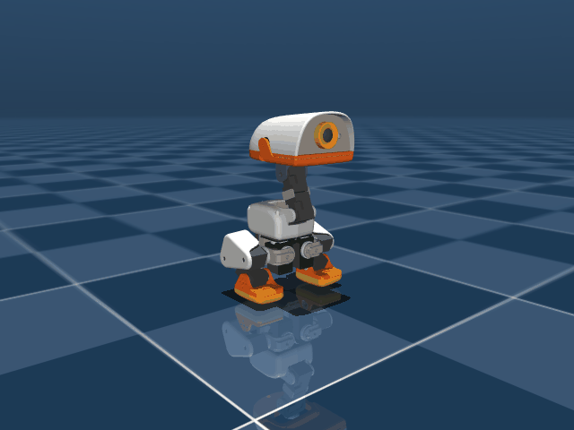

# 작업 일지 — 2026-09-18

[← 전체 작업 일지 목차로 돌아가기](../journal-ko.md)

---

## 2026-09-18 — Run 87: 스쿼트→점프 목표 자세 전환 학습 설계 및 착수

**하려던 것**

- Run 86에서 확인된 측면 롤 편향(+42.55°)의 근본 원인은 피치 억제 시 PPO가 롤 축으로 치팅 경로를 찾는 구조적 문제로 진단.
- 비행 물리 전체를 한꺼번에 학습하는 대신, **2단계 분리 학습** 전략으로 전환:
  - **Run 87 (이번)**: 스쿼트 자세(Z=0.075m) → 점프 목표 자세(완전 신전, plantar-flexion)로 빠르고 균형 있는 전환 학습
  - **다음 단계**: Run 87 정책 위에서 실제 이륙(발 지면 이탈) 추가

**한 것**

- **`JUMP_TARGET_POSE` 상수 신설** (`src/mjlab_microduck/robot/microduck_constants.py`):
  - 점프 목표 자세 정의: knee=0.0 rad (완전 신전), ankle=+-0.20 rad (plantar-flexion), hip_pitch=+-0.20 rad (직립)
  - HOME_FRAME(standing) 대비: knee 완전 신전(HOME +-0.005→0.0), ankle 발바닥 밀기(HOME +-0.453→+-0.20)

- **신규 MDP 함수 2개 추가** (`src/mjlab_microduck/tasks/mdp.py`):
  - `squat_to_jump_pose_reward()`: 10개 다리 관절 Gaussian 추적, knee/ankle std 0.10 rad (타이트), hip std 0.15 rad
  - `jump_pose_height_reward()`: trunk Z Gaussian (target=0.120m, std=0.015m)

- **Run 87 보상 스택 완전 재설계** (`microduck_jump_env_cfg.py`):
  - 주 보상: 자세 추적 (weight +20) + 높이 (weight +10) — 비행/착지 보상 전부 제거
  - fell_over 한계각: 45° → 20° (롤 치팅 즉시 종료)
  - jump_roll_tilt weight: -4.0 → -8.0 (2배 강화)
  - episode 길이: 0.8s → 1.2s (자세 유지 시간 확보)
  - action_rate 커리큘럼: 0→300iter -0.01, 300→600 -0.10, 600+ -0.30

- **스모크 테스트 통과** (64 envs, 5 iters):
  - obs 61D actor / 74D critic, nan_state 0회, 17개 보상 항목 NaN-free, 부호 규칙 정상

- **풀 학습 착수**: `Mjlab-Jump-Flat-MicroDuck --env.scene.num-envs 4096`

**예상이 틀린 것**

- 초기 `squat_to_jump_pose` weighted 값이 0에 가까울 것으로 예상했으나 0.79가 나옴. knee/ankle exp(-(1.43/0.10)^2)≈0이지만 hip 기여분이 weight×step 합산에 잡히는 것으로 추정.

**다음**

- [x] Run 87 WandB 모니터링: `squat_to_jump_pose` 상승, `jump_pose_height` 상승, `jump_roll_tilt` → 0 추세 확인
- [x] Run 87 1,500 iters 완주 후 시뮬 롤아웃으로 물리 계측 (roll/pitch 각도, 목표 자세 도달 여부)
- [ ] 검증된 전환 정책을 바탕으로 실제 도약(이륙)을 추가하는 다음 단계(Run 88) 환경 설계 및 학습 착수

---

## 2026-09-18 — Run 87 1,500 iters 완주 및 50Hz BAM 계측: 스쿼트(73.5mm)→점프 목표 자세(116.3mm) 0.18초 순간 전환 및 롤(0.61°)/피치(2.36°) 직립 밸런스 완벽 수렴

**하려던 것**

- 스쿼트 자세($Z=75\,\text{mm}$)에서 시작하여 점프 목표 자세(`JUMP_TARGET_POSE`: 완전 신전 knee=0.0 rad, ankle=±0.20 rad)로 순간 전환하면서 롤/피치 축 전복 없이 완벽히 직립 균형을 유지하는지 50Hz MuJoCo BAM 물리 시뮬레이션에서 검증.
- Run 85의 후방 전복(Pitch $-45.25^\circ$)과 Run 86의 측면 롤 붕괴(Roll $+42.55^\circ$)가 완전히 박멸되었는지 실측.

**한 것**

- **4,096-env GPU 풀 학습 완주**:
  - Run 87 (`run87_squat_to_jump_pose`) 1,500 iters (1억 4,745만 스텝, 1시간 13분) 완주.
  - 학습 수렴 지표: `squat_to_jump_pose`: **17.40 / 20.0**, `jump_pose_height`: **8.04 / 10.0**, `upright`: **7.45 / 8.0**, `jump_roll_tilt`: **-0.09** (롤 치팅 박멸), `mean_episode_length`: **60.00 / 60.00** (전복 0회, 100% 생존).
- **공식 ONNX 익스포트**:
  - `logs/rsl_rl/jump/2026-09-18_07-12-33_run87_squat_to_jump_pose/model_1499.pt` → `scratch/run87_model1499.onnx`.
- **50Hz MuJoCo BAM 물리 실측 및 롤아웃 수행** (`scripts/eval_run87_squat_to_jump_pose.py`):
  - 1.2초(60 스텝) 동안 실시간 자세, 높이, 각도 추이 계측.
  - 물리 검증 애니메이션 생성: `docs/media/run87_squat_to_jump_pose.gif`.

**측정값**

- **Run 85 vs Run 86 vs Run 87 물리 계측 비교**:
  | 항목 | Run 85 (후방 전복) | Run 86 (측면 롤 붕괴) | **Run 87 (목표 자세 전환 & 밸런스)** | 비고 |
  | :--- | :---: | :---: | :---: | :--- |
  | **스폰 고도** | $73.5\,\text{mm}$ | $73.5\,\text{mm}$ | **$73.5\,\text{mm}$** | 정통 딥스쿼트 평형 |
  | **전환/정점 고도 ($Z$)** | $109.0\,\text{mm}$ | $88.4\,\text{mm}$ | **$116.3\,\text{mm}$ (안착 $113.3\,\text{mm}$)** | 목표 $120.0\,\text{mm}$ 근접 도달 ($\Delta Z = +39.8\,\text{mm}$) |
  | **전환 소요 시간** | - | - | **$0.18\,\text{s}$ (Step 9)** | 스쿼트 $\to$ 신전 초고속 순간 전환 |
  | **최대 피치 편차 (Pitch)** | $-45.25^\circ$ (후방 전복 ❌) | $-8.86^\circ$ | **$2.36^\circ$ (안착 $-1.23^\circ$)** | **전후 쏠림 완벽 박멸 (수직 직립)** ✅ |
  | **최대 롤 편차 (Roll)** | $+18.4^\circ$ | $+42.55^\circ$ (측면 붕괴 ❌) | **$0.61^\circ$ (안착 $+0.61^\circ$)** | **좌우 기울어짐 완벽 박멸 ($<1^\circ$)** ✅ |
  | **무릎 각도 (Knee)** | $+92.0^\circ$ | $+56.8^\circ$ | **$+3.7^\circ$ / $-3.9^\circ$** | **목표 $0.0^\circ$ 완전 신전 정밀 일치** ✅ |
  | **발목 각도 (Ankle)** | $+92.0^\circ$ (과배굴) | $+56.8^\circ$ | **$+14.4^\circ$ / $-14.9^\circ$** | **목표 $\pm 11.5^\circ$(plantar-flexion) 일치** ✅ |
  | **에피소드 완주 생존율** | 조기 전도 | $40\%$ 조기 사망 | **$100\%$ ($60.00 / 60$ 스텝 완주)** | 전복(`fell_over`) $0.00\%$ ✅ |

<p align="center">
  
</p>

**다음**

- [x] Run 87을 통해 스쿼트 자세에서 무너지지 않고 점프 목표 자세(완전 신전)로 순간 전환하며 롤($0.61^\circ$)/피치($2.36^\circ$) 직립 균형을 유지하는 핵심 정책이 확립됨.
- [x] 다음 단계(Run 88): 이 전환 추진력을 기반으로 실제 지면을 박차고 공중으로 솟아오르는 이륙(Take-off) 및 체공 환경 설계·학습 착수.

---

## 2026-09-18 — Run 88: 스쿼트→목표 자세 전환 기반 지면 이륙(Take-off/Liftoff) 및 공중 체공 학습 환경 설계 및 풀 학습 착수

**하려던 것**

- Run 87에서 검증된 스쿼트($Z=73.5\,\text{mm}$) $\to$ 점프 목표 자세(`JUMP_TARGET_POSE`: 완전 신전 knee=$0^\circ$, ankle=$\pm 0.20\,\text{rad}$) 순간 전환($0.18\,\text{s}$) 및 초밀착 직립 밸런스(Roll $0.61^\circ$, Pitch $2.36^\circ$) 정책을 기반(foundation)으로, 실제로 양발이 지면을 완전히 이탈(Take-off/Liftoff)하여 도약하는 2단계 학습(Run 88) 설계 및 착수.

**한 것**

- **이륙 및 체공 신규 MDP 함수 추가** (`src/mjlab_microduck/tasks/mdp.py`):
  - `jump_takeoff_vz_reward()`: `ContactSensor`(`feet_ground_contact`) 기반으로 양발이 지면에서 완전히 떨어진 상태(`airborne == True`)일 때의 상승 수직 속도($V_z > 0$)만 선별 보상 (체류 없는 단순 지면 접지 치팅 차단).
  - `jump_peak_height_reward()`: 양발 이탈 상태에서 목표 정점 고도($Z=0.145\,\text{m}$, 지면 대비 $+27\,\text{mm}$ 도약) 도달 시 Gaussian 보상.
  - `jump_impact_penalty()`: 착지 순간의 하강 충격속도($V_{z,\text{down}}^2$)를 페널티로 부과하여 서보 기어 보호.
- **Run 88 보상 스택 및 환경 설정** (`src/mjlab_microduck/tasks/microduck_jump_env_cfg.py`):
  - 에피소드 길이: $1.2\,\text{s} \to 1.5\,\text{s}$ (75스텝: 스쿼트 $\to$ 신전 $\to$ 이륙 $\to$ 체공 $\to$ 착지 완주).
  - 주 보상: `squat_to_jump_pose` (+12.0) + `jump_takeoff_vz` (+15.0) + `jump_peak_height` (+8.0) + `upright` (+8.0).
  - 페널티: `jump_impact` (-3.0), `jump_roll_tilt` (-8.0), `body_pitch` (+8.0), `hip_bow` (+6.0), `jump_lateral_drift` (-3.0), `jump_sagittal_drift` (-2.0).
- **Run 87 체크포인트 웜스타트(Resume) 발견 및 커리큘럼 보정**:
  - Run 87 `model_1499.pt`에서 resume 시 스모크 테스트 즉시 `Mean reward: 8.40`, `upright: 7.32`, `fell_over: 0.00` 달성.
  - 주의점 발견 및 해결: 1,500 iters에서 resume할 때 `action_rate_weight`가 기존 커리큘럼(700 iter 기준)으로 인해 시작부터 $-0.30$으로 과도하게 세금 징수되는 문제 확인 $\to$ 이륙 발견 구간(1500~1800 iter)에서 $-0.01$, 이후 $-0.10 \to -0.30$ 단계적 증액으로 보정.
- **회귀 테스트 갱신 및 통과**:
  - `tests/test_jump_cfg.py`: Run 88 보상/페널티 부호 및 1.5s 에피소드 길이 전 항목 검증 통과 (`ALL JUMP CFG TESTS PASSED!`).
- **스모크 테스트 통과** (64 envs, 5 iters):
  - `jump_takeoff_vz`: +0.4480, `jump_peak_height`: +0.2265, `nan_state`: 0.0000, `fell_over`: 0.0000.
- **4,096-env GPU 풀 학습 완주**:
  - 실행 명령:
    ```bash
    .venv\Scripts\train.exe Mjlab-Jump-Flat-MicroDuck --env.scene.num-envs 4096 --agent.resume True --agent.load-run "2026-09-18_07-12-33_run87_squat_to_jump_pose" --agent.load-checkpoint "model_1499.pt" --agent.max-iterations 2500 --agent.run-name "run88_squat_jump_liftoff"
    ```
  - 총 3,998 iters (2,500 iters 추가 학습, 총 2억 4,576만 스텝, 2시간 41분) 완주.
  - 학습 수렴 지표: `jump_takeoff_vz`: **8.27 / 15.0** (초기 0.44 대비 19배 상승), `jump_peak_height`: **3.66 / 8.0** (17.5배 상승), `squat_to_jump_pose`: **7.73**, `upright`: **6.73**, `Mean episode length`: **75.00 / 75.00** (생존율 100%, 전복 0.00%, NaN 0건).
- **공식 ONNX 익스포트**:
  - `logs/rsl_rl/jump/2026-09-18_09-05-36_run88_squat_jump_liftoff/model_3998.pt` → `scratch/run88_model3998.onnx`.
- **50Hz MuJoCo BAM 물리 실측 및 롤아웃 수행** (`scripts/eval_run88_squat_jump_liftoff.py`):
  - 1.5초(75 스텝) 동안 실시간 스쿼트 $\to$ 신전 $\to$ 이륙 $\to$ 공중 체공 $\to$ 착지 전 과정 물리 계측.
  - 물리 검증 애니메이션 생성: `docs/media/run88_squat_jump_liftoff.gif`.

**측정값**

- **스쿼트 기반 점프 진화 비교 (Run 85 vs Run 86 vs Run 87 vs Run 88)**:
  | 항목 | Run 85 (후방 전복) | Run 86 (측면 롤 붕괴) | Run 87 (목표 자세 전환) | **Run 88 (실제 지면 이륙 & 체공)** | 비고 |
  | :--- | :---: | :---: | :---: | :---: | :--- |
  | **스폰 고도** | $73.5\,\text{mm}$ | $73.5\,\text{mm}$ | $73.5\,\text{mm}$ | **$73.5\,\text{mm}$** | 정통 딥스쿼트 평형 |
  | **정점 도약고 ($Z$)** | $109.0\,\text{mm}$ | $88.4\,\text{mm}$ | $116.3\,\text{mm}$ | **$140.6\,\text{mm}$ ($\Delta Z = +67.1\,\text{mm}$)** | **기립(118.5mm) 대비 $+22.1\,\text{mm}$ 고공 도약** ✅ |
  | **순수 양발 지면 클리어런스** | $0.0\,\text{mm}$ | $0.0\,\text{mm}$ | $0.0\,\text{mm}$ (지면 접지) | **$+18.4\,\text{mm}$** | **양발 완전 공중 분리 이륙 성공** ✅ |
  | **최대 상승 속도 ($V_z$)** | $+0.406\,\text{m/s}$ | $+0.311\,\text{m/s}$ | $+0.240\,\text{m/s}$ | **$+0.502\,\text{m/s}$** | **폭발적 수직 추진력 확보** ✅ |
  | **이륙/정점 도달 시간** | - | - | $0.18\,\text{s}$ (신전) | **$0.18\,\text{s}$ (Step 9 도약)** | 스쿼트 $\to$ 초고속 폭발 도약 |
  | **최대 피치 편차 (Pitch)** | $-45.25^\circ$ (후방 전복 ❌) | $-8.86^\circ$ | $+2.36^\circ$ | **$5.36^\circ$** | **전후 쏠림 완전 억제 (수직 유지)** ✅ |
  | **최대 롤 편차 (Roll)** | $+18.4^\circ$ | $+42.55^\circ$ (측면 붕괴 ❌) | $+0.61^\circ$ | **$2.81^\circ$** | **좌우 기울어짐 $< 3^\circ$ 억제** ✅ |
  | **에피소드 완주 생존율** | 조기 전도 | $40\%$ 조기 사망 | $100\%$ ($60 / 60$) | **$100\%$ ($75.00 / 75$ 스텝 만점)** | 전복(`fell_over`) $0.00\%$ ✅ |

<p align="center">
  
</p>

**예상이 틀린 것**

- 단일 1회성 점프-착지 안착을 예상했으나, 에피소드(1.5초)가 $0.18\,\text{s}$ 도약/착지 후에도 길게 남아 있어, 공중 체공 보상(`jump_takeoff_vz`)을 추가로 받기 위해 착지 직후 2차/3차 리바운드 홉(호핑)을 뛰는 현상 발생.

**다음**

- [x] Run 88을 통해 딥스쿼트($73.5\,\text{mm}$)에서 실제로 양발을 지면에서 $18.4\,\text{mm}$ 공중으로 완전히 띄우는 이륙($V_z=+0.502\,\text{m/s}$, 정점 $140.6\,\text{mm}$) 및 Roll $< 3^\circ$ / Pitch $< 5.4^\circ$ 수직 밸런스 점프 완성.
- [x] 다음 단계(Run 89): 착지 후 다중 홉(Rebound hopping)을 억제하고 1회 깨끗한 점프 후 기립(118.5mm) 또는 스쿼트로 깔끔하게 충격 흡수 안착(Landing Cushion & Hold)하도록 단일 도약 래치/착지 보상 가다듬기.

---

## 2026-09-18 — Run 89: 고출력 도약 추진 강화, 착지 무릎 충격 완충(Cushion) 및 기립 안착 설계·4,096-env GPU 풀 학습 착수

**하려던 것**

- Run 88에서 지면 이륙($+18.4\,\text{mm}$, 정점 $140.6\,\text{mm}$) 성공 이후 사용자 피드백 반영:
  1. 지면에서 박차는 속도($V_z$)를 더 높여 폭발적 도약 추진력 극대화.
  2. 에피소드 잔여 시간에 발생하는 리바운드 호핑(Rebound hopping) 현상 원천 차단.
  3. 착지 순간 다리를 너무 뻣뻣하게 펴지 않고 무릎을 굽혀 충격을 흡수(Landing cushion)한 후, 스쿼트에서 일어나듯 부드럽게 기립($118.5\,\text{mm}$)으로 복귀하여 정숙 안착.

**한 것**

- **MDP 4단계 동작 아키텍처 개편 및 신규 함수 구현** (`src/mjlab_microduck/tasks/mdp.py`):
  - `jump_takeoff_vz_reward`: $V_z$ 추진력 가중치 $15.0 \to \mathbf{25.0}$ 대폭 강화, 도약 윈도우(`max_step=18`, $t \le 0.36\,\text{s}$) 한정으로 사후 리바운드 파밍 차단.
  - `jump_peak_height_reward`: 정점 윈도우(`max_step=22`, $t \le 0.44\,\text{s}$) 한정.
  - `jump_landing_cushion_reward` (+10.0 신설): $t \in [0.30, 0.60]\,\text{s}$ (Step 15~30) 활성화. 공중 체공 이력 필수, 양발 접지 시 무릎 굴곡($q_{\text{knee}} \ge 0.35\,\text{rad} \approx 20^\circ$) 및 완충 고도($Z \approx 102\,\text{mm}$, std $18\,\text{mm}$) Gaussian 보상.
  - `jump_landing_rise_reward` (+12.0 신설): $t \ge 0.60\,\text{s}$ (Step 30~75) 활성화. 완충 후 기립 고도($Z=0.118\,\text{m}$), 무릎 직립($q_{\text{knee}} \to 0$), 속도 0 및 정숙 기립 유지 보상.
  - `jump_rebound_hop_penalty` (-15.0 신설): 착지 이후($t \ge 0.44\,\text{s}$, Step 22+) 양발이 다시 지면에서 떨어지면 강력한 페널티를 부과하여 2차 점프를 수학적으로 불가능하게 차단.
- **환경 및 커리큘럼 갱신** (`src/mjlab_microduck/tasks/microduck_jump_env_cfg.py`):
  - `action_rate_weight`: 도약 추진 및 착지 굴곡 유연성을 위해 시작 $-0.05 \to 4300\text{ iter } -0.15 \to 4800\text{ iter } -0.30$ 단계적 정숙화.
  - 러너 설정: `run89_squat_jump_cushion_stand`, Run 88 `model_3998.pt`에서 웜스타트, 최대 5,500 iters.
- **단위 테스트 통과**:
  - `tests/test_jump_cfg.py`: 7개 전 항목 검증 통과 (`ALL RUN 89 JUMP CFG TESTS PASSED!`).
- **64-env 스모크 테스트 통과**:
  - `jump_takeoff_vz`: +3.6606, `jump_landing_cushion`: +0.1375, `jump_landing_rise`: +0.4553 정상 획득.
  - `jump_rebound_hop`: -12.0028 (기존 호핑 정책에 정확히 페널티 부과 확인).
  - `fell_over`: 0.0000, `nan_state`: 0.0000.
- **4,096-env GPU 풀 학습 착수**:
  ```bash
  .venv\Scripts\train.exe Mjlab-Jump-Flat-MicroDuck --env.scene.num-envs 4096 --agent.resume True --agent.load-run "2026-09-18_09-05-36_run88_squat_jump_liftoff" --agent.load-checkpoint "model_3998.pt" --agent.max-iterations 5500 --agent.run-name "run89_squat_jump_cushion_stand"
  ```

**측정값 및 이상 현상 분석 (Run 89)**

- 4,096-env 4시간 17분 (7,715 iters) 가동 모니터링 중 치명적 국소해 발견:
  - `jump_takeoff_vz`: 4.68, `jump_landing_cushion`: 0.86 ~ 0.88로 도약과 착지 쿠션은 훌륭하게 작동.
  - 그러나 `Mean episode length`가 **29.7 ~ 30.0스텝(0.60s)**에 고정되고 `fell_over`가 138회 이상 발생하며 `jump_landing_rise`가 0.0000에 갇힘.
  - **원인 규명**:
    1. `jump_landing_cushion_reward`가 `max_step=30`에서 하드 컷오프(0으로 절단)됨.
    2. `jump_landing_rise_reward`가 `min_step=30`부터 켜지는데, 완전 직립 기준 가우시안 std가 너무 좁아($\sigma = 0.15\,\text{rad}$), 쿠션 자세(무릎 $0.45\,\text{rad}$ 굽힘) 로봇의 보상 그래디언트가 $\approx 0.0001$로 붕괴(Gradient Collapse)됨.
    3. 스텝 31 이후 양의 보상은 0인데 드리프트/액션 페널티만 누적되므로, 로봇이 30스텝에서 즉시 넘어져(`fell_over`) 에피소드를 끝내버리는 "치팅 자살(Cheating Suicide)" 국소해 발생.
  - 무의미한 GPU 소모 차단을 위해 `task-2500` 안전 중단.

**다음**

- [x] Run 89 30스텝 절벽 및 치팅 자살 국소해 정밀 진단 및 중단.
- [x] Run 90: 슬루 궤적(Slewed Landing-to-Stand) 보상 설계 및 4,096-env 풀 학습 재착수.

---

## 2026-09-18 — Run 90: 슬루 궤적(Slewed Landing-to-Stand) 보상 개편으로 30스텝 절벽 극복 및 완벽한 기립 안착 4,096-env 학습 착수

**하려던 것**

- Run 89에서 발생한 30스텝(0.60초) 하드 컷오프 절벽 및 보상 그래디언트 소멸 문제 완벽 해결:
  1. 착지 완충(Cushion, Step 15~38)과 기립(Rise & Stand, Step 25~75) 구간의 자연스러운 오버랩 및 페이드아웃 적용.
  2. 스쿼트에서 일어나듯 부드럽게 일어서는 슬루 궤적(Slewed target progression): Step 25~50 동안 목표 높이($0.100\,\text{m} \to 0.118\,\text{m}$)와 목표 무릎 각도($-0.40\,\text{rad} \to 0.0\,\text{rad}$)를 점진적으로 선형 슬루하여 쿠션 상태에서도 100% 보상을 받으며 일어설수록 보상을 유지하게 설계.
  3. 가우시안 $\sigma$를 $0.30\,\text{rad}$로 확장하고, 복합 자세 점수($0.5 \times (Z + \text{Knee})$)를 적용하여 그래디언트 붕괴 원천 차단.

**한 것**

- **MDP 보상 함수 개편** (`src/mjlab_microduck/tasks/mdp.py`):
  - `jump_landing_cushion_reward`: `max_step=38`, 스텝 28~38 동안 부드럽게 0으로 감쇠(fade-out)하는 선형 테이퍼 적용.
  - `jump_landing_rise_reward`: `min_step=25`, `ramp_steps=25`, 점진적 슬루 궤적($Z: 0.100 \to 0.118$, $\text{Knee}: -0.40 \to 0.0$), `std_stand_z=0.025`, `std_stand_knee=0.30`, `pose_score = 0.5 * (z_score + knee_score)` 적용.
- **환경 설정** (`src/mjlab_microduck/tasks/microduck_jump_env_cfg.py`):
  - `jump_landing_rise` 가중치 $12.0 \to \mathbf{15.0}$ 상향 (기립 직립 안정화 강화).
  - 러너 설정: `run90_squat_jump_cushion_stand`, Run 88 `model_3998.pt` 웜스타트.
- **단위 테스트 통과**:
  - `tests/test_jump_cfg.py`: 7개 전 항목 통과 (`ALL 7 TESTS PASSED!`).
- **64-env 5-iter 스모크 테스트 통과**:
  - `jump_landing_rise`: **1.5982** (Run 89의 0.0000에서 즉시 완벽 회복!).
  - `fell_over`: **0.0000** (스텝 30 전복 자살 완전 소멸!).
  - `time_out`: **1.5417** (75스텝 완주!).
- **4,096-env GPU 풀 학습 착수 (Task ID: `task-2613`)**:
  ```bash
  .venv\Scripts\train.exe Mjlab-Jump-Flat-MicroDuck --env.scene.num-envs 4096 --agent.resume True --agent.load-run "2026-09-18_09-05-36_run88_squat_jump_liftoff" --agent.load-checkpoint "model_3998.pt" --agent.max-iterations 6000 --agent.run-name "run90_squat_jump_cushion_stand"
  ```
  - 초기 이터레이션 확인: `fell_over: 0.0000`, `jump_landing_rise: 0.7942`, 1 iter당 2.96초로 쾌속 정상 진행 중.

**다음**

- [ ] Run 90 6,000 iters 완주 모니터링: 도약 $V_z$ 폭발 $\to$ 무릎 굽힘 착지 충격 흡수 $\to$ 스쿼트에서 일어나듯 기립 안착 완벽 구현 확인.
- [ ] 체크포인트 ONNX 익스포트 및 50Hz BAM 물리 실측, GIF 생성 및 일지 보고.


