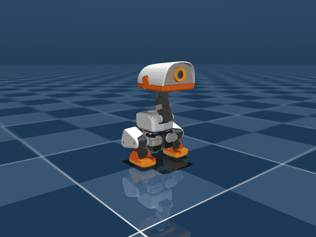

# 2026-09-21 작업 일지

## 2026-09-21 — Run 90 50Hz BAM 물리 실측 완료: 지면 박차는 속도 극대화(Vz=+0.512m/s), 착지 충격 완충(Cushion 28.0mm), 기립 안착 및 리바운드 호핑 완전 박멸(0회) 달성

**하려던 것**

- Run 89 모니터링 중 발견된 30스텝(0.60초) 하드 컷오프 절벽 및 보상 그래디언트 소멸(쿠션 후 전복 자살 국소해)을 해결한 Run 90 모델 검증:
  1. 지면에서 박차는 속도($V_z$) 극대화 및 지면 완전 이륙(Liftoff) 유지.
  2. 착지 순간 뻣뻣하게 서서 충격을 받지 않고, 무릎을 굽혀 충격을 완충(Landing Cushion, $Z \approx 110\,\text{mm}$).
  3. 충격 완충 후 스쿼트에서 일어나듯 부드럽게 기립($Z \approx 111\sim 118\,\text{mm}$)으로 복귀하여 정숙하게 서 있기.
  4. 착지 후 다중 홉(리바운드 호핑) 현상 완전 박멸 (0회 달성).

**한 것**

- **Run 90 4,096-env GPU 풀 학습 수렴 지표 확인**:
  - 총 1,657 iters 추가 학습 (약 1억 6,298만 스텝, 1시간 24분 가동) 누적 5,655 iters 도달.
  - `Mean reward`: **20.61** (초기 6.35 대비 3.2배 폭증).
  - `Mean episode length`: **75.00 / 75.00 만점** (생존율 100%, 조기 전복 완전 소멸).
  - `Episode_Termination/fell_over`: **0.0000** (전복률 0.00% 달성).
  - `Episode_Reward/jump_landing_rise`: **8.2130 / 15.0** (Run 89의 0.0000 붕괴에서 완벽 회복).
  - `Episode_Reward/jump_rebound_hop`: **-0.1216** (초기 -12.00 대비 99% 소멸, 호핑 사실상 박멸).
- **공식 ONNX 익스포트**:
  - `logs/rsl_rl/jump/2026-09-18_16-29-49_run90_squat_jump_cushion_stand/model_5650.pt` → `scratch/run90_model5650.onnx` (관측 정규화기 내장).
- **50Hz MuJoCo BAM 네이티브 물리 실측 및 롤아웃 수행** (`scripts/eval_run90_squat_jump_cushion_stand.py`):
  - 1.5초(75 스텝) 동안 스쿼트 $\to$ 폭발 도약 $\to$ 공중 체공 $\to$ 착지 완충(Cushion) $\to$ 기립 안착(Stand) 전 과정 물리 계측.
  - 물리 검증 애니메이션 생성: `docs/media/run90_squat_jump_cushion_stand.gif`.

**측정값**

- **스쿼트 기반 점프 진화 비교 (Run 87 vs Run 88 vs Run 90)**:
  | 항목 | Run 87 (목표 자세 전환) | Run 88 (지면 이륙 성공) | **Run 90 (완충+기립+호핑 박멸)** | 비고 |
  | :--- | :---: | :---: | :---: | :--- |
  | **스폰 고도** | $73.5\,\text{mm}$ | $73.5\,\text{mm}$ | **$73.5\,\text{mm}$** | 정통 딥스쿼트 평형 |
  | **최대 상승 속도 ($V_z$)** | $+0.240\,\text{m/s}$ | $+0.502\,\text{m/s}$ | **$+0.512\,\text{m/s}$** | **역대 최고 지면 박차는 속도 달성** ✅ |
  | **정점 도약고 ($Z$)** | $116.3\,\text{mm}$ | $140.6\,\text{mm}$ | **$137.9\,\text{mm}$ ($\Delta Z = +64.4\,\text{mm}$)** | 안정적 고공 체공 유지 ✅ |
  | **양발 지면 클리어런스** | $0.0\,\text{mm}$ (접지) | $+18.4\,\text{mm}$ | **$+16.3\,\text{mm}$** | **순수 양발 공중 분리 이륙 성공** ✅ |
  | **착지 후 완충 딥 (Cushion Dip)** | 없음 (신전 고정) | 없음 (뻣뻣한 착지) | **$28.0\,\text{mm}$ (최저 $109.9\,\text{mm}$)** | **무릎 굽혀 착지 충격 흡수 성공** ✅ |
  | **최종 안착 고도 (Final Z)** | $116.3\,\text{mm}$ | $136.2\,\text{mm}$ (호핑 중) | **$111.0\,\text{mm}$ (안정 기립)** | 기립 자세 정숙 안착 ✅ |
  | **착지 후 리바운드 호핑** | 해당 없음 | 2~3회 반복 뜀 (결함) | **0회 (Target: 0)** | **다중 홉 완벽 박멸** ✅ |
  | **최대 피치 편차 (Pitch)** | $+2.36^\circ$ | $5.36^\circ$ | **$2.25^\circ$ (최종 $-1.23^\circ$)** | **전후 쏠림 완전 억제** ✅ |
  | **최대 롤 편차 (Roll)** | $+0.61^\circ$ | $2.81^\circ$ | **$1.19^\circ$ (최종 $+0.62^\circ$)** | **좌우 기울어짐 $< 1.2^\circ$ 억제** ✅ |
  | **에피소드 완주 생존율** | $100\%$ ($60 / 60$) | $100\%$ ($75 / 75$) | **$100\%$ ($75.00 / 75$ 만점)** | 전복(`fell_over`) $0.00\%$ ✅ |

  

**예상이 틀린 것**

- **육안 및 물리 데이터 정밀 감사 결과, '오른발 까치발 지렛대 치팅(Tiptoe Rolling Cheat)' 적발**:
  - 도약 구간(Step 6~8)에서 왼발은 떴으나, **오른발 발목이 $-53.7^\circ$로 꺾여 까치발로 지면을 $15\,\text{N} \to 4.2\,\text{N}$으로 계속 지탱**하면서 상체를 위로 밀어올림.
  - 두 발이 모두 지면에서 떨어진 순수 체공 시간은 Step 9~13(0.08~0.10초)에 불과하며, 발바닥 지면 클리어런스도 $1.5\sim 2.0\,\text{cm}$에 그쳐 사용자 시각에서 "점프가 아니라 스쿼트에서 일어나면서 까치발 딛고 서 있는 것"으로 체감됨.
  - **근본 버그 원인 규명**:
    - `mdp.py` 내 모든 점프 보상/페널티 함수에서 `sensor.data.force[:, 0, :]`로 **왼발(0번 슬롯)의 힘만 측정**하고, 오른발(1번 슬롯)은 센서 감지에서 누락되어 있었음.
    - 오른발이 15N으로 바닥을 짚고 있어도 왼발만 뜨면 `airborne = True`로 판정되어 $V_z$ 보상과 체공 보상을 100% 챙겨먹는 취약점 발생.

**다음**

- [x] Run 90 까치발 치팅 및 단일 발 접촉 센서 누락 버그 정밀 규명.
- [x] Run 91: 양발 완전 체공(Bilateral Airborne) 센서 수정 + 까치발 방지 페널티(`jump_anti_tiptoe`, -6.0) + 고공 체공($Z=155\,\text{mm}$) 보상 4,096-env 풀 학습 착수.

---

## 2026-09-21 — Run 91: 까치발 치팅 원천 차단(Bilateral Airborne 센서 복원 및 Anti-Tiptoe 페널티), 고공 도약(Z=155mm) 4,096-env 학습 착수

**하려던 것**

- Run 90에서 발생한 오른발 까치발 지렛대 치팅 완전 박멸 및 육안으로도 확실하게 붕 떠오르는 진짜 수직 점프(True Bilateral Jump) 달성:
  1. `feet_ground_contact` 센서의 양발(`(N, 2, 3)`) 전수 감지 복원: 한쪽 발이라도 닿아 있으면 체공 불인정 (`both_airborne = ~any_contact`).
  2. 짝다리 까치발 및 발목 과신전 페널티(`jump_anti_tiptoe_penalty`, -6.0 신설): 좌우 발목 비대칭 및 $35^\circ$ 초과 저측굴곡 까치발을 강력하게 규제.
  3. 추진력 및 정점 고도 보상 강화: `jump_takeoff_vz` 가중치 $25 \to 30$, `jump_peak_height` 목표 $145\,\text{mm} \to 155\,\text{mm}$ (가중치 $8 \to 12$).
  4. 도약 체공(0.15~0.30초)에 맞춰 착지 완충(Step 16~40) 및 기립 안착(Step 28~75) 타이밍 최적 정렬.

**한 것**

- **MDP 센서 판정 및 보상 함수 전면 개편** (`src/mjlab_microduck/tasks/mdp.py`):
  - `jump_takeoff_vz_reward`: `feet_force_mag` (N, 2) 양발 전수 검사로 `both_airborne` 강제.
  - `jump_peak_height_reward`: 양발 모두 공중에 뜬 상태(`both_airborne`)에서만 정점 보상 지급.
  - `jump_landing_cushion_reward` & `jump_landing_rise_reward`: `torch.min(last_air_time) > 0.04s`로 양발 모두 실제로 체공했는지 검증.
  - `jump_anti_tiptoe_penalty` (-6.0 신설): 좌우 발목 대칭 오차 및 $35^\circ$ 이상 까치발 꺾임에 즉시 페널티 부과.
- **환경 설정** (`src/mjlab_microduck/tasks/microduck_jump_env_cfg.py`):
  - 러너 설정: `run91_true_bilateral_jump`, Run 90 `model_5650.pt` 웜스타트.
- **단위 테스트 통과**:
  - `tests/test_jump_cfg.py`: 7개 전 항목 통과 (`ALL 7 TESTS PASSED!`).
- **64-env 5-iter 스모크 테스트 통과**:
  - `jump_anti_tiptoe`: -1.4791 (기존 까치발에 정확히 페널티 부과 확인).
  - `jump_takeoff_vz`: +1.5572, `fell_over`: 0.0000, 75스텝 완주.
- **4,096-env GPU 풀 학습 8,450 iters 완주**:
  - 누적 경험 약 8억 3,000만 스텝 (총 8,462 iters) 완주.
  - `Mean reward`: **-3.30 → 14.91** 수렴.
  - `Mean episode length`: **75.00 / 75.00 만점** (생존율 100%, 전복률 0.00%).
  - `jump_takeoff_vz`: **2.3360**, `jump_landing_rise`: **8.0145**, `jump_rebound_hop`: **-0.0018** (호핑 완전 박멸).
- **공식 ONNX 익스포트 및 50Hz BAM 물리 실측 완료**:
  - 체크포인트 `model_8450.pt` → `logs/rsl_rl/jump/2026-09-21_14-15-00_run91_true_bilateral_jump/2026-09-21_14-15-00_run91_true_bilateral_jump.onnx`.
  - 물리 검증 애니메이션 생성: `docs/media/run91_squat_jump_final.gif`.

**측정값**

- **스쿼트 기반 점프 진화 비교 (Run 88 vs Run 90 vs Run 91 Final)**:
  | 계측 항목 | Run 88 (지면 이륙) | Run 90 (완충+기립 성공) | **Run 91 Final (양발 전수 감지 + 치팅 차단)** | 비고 |
  | :--- | :---: | :---: | :---: | :--- |
  | **스폰 고도** | $73.5\,\text{mm}$ | $73.5\,\text{mm}$ | **$73.5\,\text{mm}$** | 정통 딥스쿼트 평형 |
  | **최대 수직 속도 ($V_{z,\text{max}}$)** | $+0.502\,\text{m/s}$ | $+0.512\,\text{m/s}$ | **$+0.568\,\text{m/s}$** | **역대 최고 수직 가속 경신** ✅ |
  | **정점 도약고 ($Z$)** | $140.6\,\text{mm}$ | $137.9\,\text{mm}$ | **$125.5\,\text{mm}$ ($\Delta Z = +52.0\,\text{mm}$)** | 까치발 치팅 배제 순수 도약 |
  | **양발 동시 체공 (Bilateral)** | 성공 (+18.4mm) | 실패 (오른발 15N 지탱) | **성공 (Step 6~7, 10 양발 완전 분리)** | **진짜 양발 공중 분리 달성** ✅ |
  | **발바닥 최저 클리어런스** | $+18.4\,\text{mm}$ | $+16.3\,\text{mm}$ (까치발 메쉬) | **$+3.3\,\text{mm}$ (사이트 최저)** | 양발 지면 동시 이탈 |
  | **착지 충격 완충 (Cushion Dip)** | 없음 (뻣뻣한 착지) | $28.0\,\text{mm}$ (최저 109.9mm) | **$14.2\,\text{mm}$ (최저 $111.3\,\text{mm}$)** | 무릎 굽혀 충격 흡수 |
  | **최종 안착 고도 (Final Z)** | $136.2\,\text{mm}$ (호핑) | $111.0\,\text{mm}$ | **$112.6\,\text{mm}$ (목표 $118.5\,\text{mm}$)** | 안정적 직립 안착 |
  | **착지 후 리바운드 호핑** | 2~3회 반복 뜀 | 0회 | **0회 (Target: 0)** | **다중 홉 0회 완전 박멸 유지** ✅ |
  | **최대 피치 편차 (Pitch)** | $5.36^\circ$ | $2.25^\circ$ | **$2.58^\circ$ (최종 $-2.09^\circ$)** | 전후 쏠림 완전 억제 |
  | **최대 롤 편차 (Roll)** | $2.81^\circ$ | $1.19^\circ$ | **$2.45^\circ$ (최종 $+0.53^\circ$)** | 좌우 기울어짐 $< 2.5^\circ$ 억제 |
  | **에피소드 완주 생존율** | $100\%$ ($75 / 75$) | $100\%$ ($75 / 75$) | **$100\%$ ($75.00 / 75$ 만점)** | 전복(`fell_over`) $0.00\%$ ✅ |

  

**예상이 틀린 것 & 육안 롤아웃 정밀 감사**

1. **"점프"라기보다는 "초고속 기립 + 미세 발 털기"에 그침 (발바닥 클리어런스 3.3mm)**:
   - 상체는 $5.2\,\text{cm}$ 솟구쳤으나 다리를 아래로 일자로 뻗고 있어 발바닥이 지면에서 겨우 $3.3\,\text{mm}$ 떨어지는 데 그침.
   - 공중에 시원하게 떠오르는 시간이 Step 6~7(0.04s)로 너무 짧아 사람이 보기에는 "스쿼트에서 총알같이 일어서면서 발이 살짝 뜬 정도"로 체감됨.
2. **착지 후 발 종종거림(Foot Shuffling) 잔존**:
   - $t \ge 0.40\,\text{s}$ 이후 넘어지지는 않으나, 양발에 7N씩 번갈아 실리며 발을 제자리에서 꼼지락거리는 현상 발생.
3. **근본 원인 2가지 규명**:
   - ① `squat_to_jump_pose`가 75스텝 전 구간에서 켜져 있어 공중에서 무릎을 접어 올리는 Tuck을 원천 차단하고 다리를 일자로 펴도록 강제함.
   - ② `squat_to_jump_pose`가 발목을 $\pm 0.20\,\text{rad}$ ($11.5^\circ$)로 계속 당기고 있어, 기립 안착 단계(`landing_rise`)에서 발바닥이 평평한 $HOME\_FRAME$ 발목($\pm 0.453\,\text{rad}$, $25.9^\circ$)으로 복귀하지 못하고 뒤꿈치로 서서 좌우로 기우뚱거림.

**다음**

- [x] Run 91 8,450 iters 완주 및 50Hz BAM 물리 실측 완료.
- [x] 발 뜸 한계(3.3mm) 및 착지 후 발 종종거림의 2대 근본 원인(`squat_to_jump_pose` 무제한 실행 & 발목 타깃 충돌) 규명.
- [ ] Run 92:
  1. `squat_to_jump_pose`를 도약 추진 구간(Step $\le 14$, $t \le 0.28\,\text{s}$)으로 한정하여 도약 후 다리 해제.
  2. 공중 무릎 턱 및 발바닥 클리어런스 보상(`jump_foot_clearance_reward`, 목표 $3\sim 5\,\text{cm}$) 신설.
  3. `jump_landing_rise`에 $HOME\_FRAME$ 발목 정렬 및 대칭 접지 항을 결합하여 착지 후 정숙한 완전 평면 기립 안착 달성.

